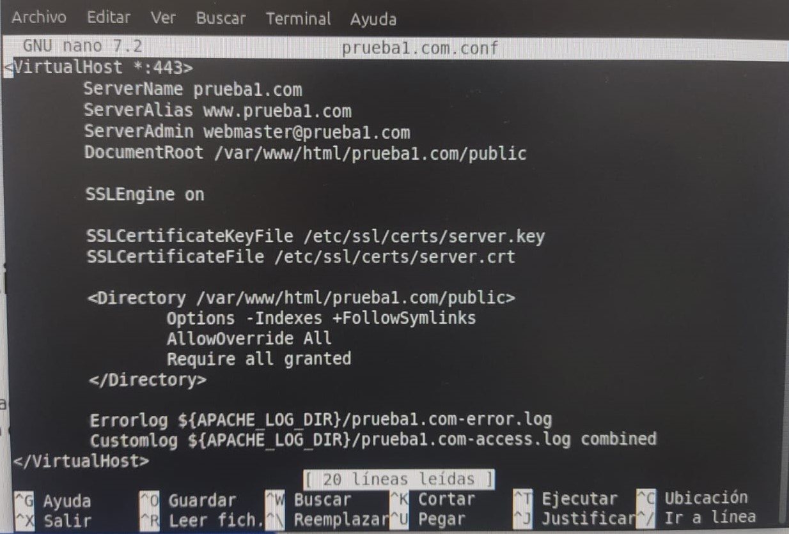

---
### **1. Crear carpetas de prueba**
Este paso organiza los archivos del sitio web en directorios separados.

```bash
sudo mkdir /var/www/prueba1.com/public
sudo mkdir /var/www/prueba2.com/public
```
- **`sudo`**: Da permisos de administrador para ejecutar el comando.
- **`mkdir`**: Crea las carpetas.
- **`/var/www/prueba1.com/public`** y **`/var/www/prueba2.com/public`**: Rutas de las carpetas. Estas rutas contienen los archivos de cada sitio web.

---

### **2. Crear archivos HTML dentro de las carpetas**
Se crean páginas iniciales para cada sitio web.

```bash
sudo nano /var/www/prueba1.com/public/index.html
sudo nano /var/www/prueba2.com/public/index.html
```
- **`nano`**: Abre un editor de texto en la terminal para crear o editar archivos.
- **`index.html`**: Es el archivo principal del sitio web, cargado por defecto en la raíz del dominio.

Dentro del archivo puedes añadir algo como:
```html
<!DOCTYPE html>
<html>
<head>
    <title>Prueba1</title>
</head>
<body>
    <h1>Bienvenido a prueba1.com</h1>
</body>
</html>
```

---

### **3. Cambiar la propiedad de las carpetas**
El servidor Apache necesita permisos sobre los archivos para funcionar correctamente.

```bash
sudo chown -R www-data: /var/www/prueba1.com/public
sudo chown -R www-data: /var/www/prueba2.com/public
```
- **`chown`**: Cambia el propietario de un archivo o carpeta.
- **`www-data`**: Usuario y grupo por defecto de Apache.
- **`-R`**: Aplica los cambios recursivamente (a todos los archivos y subcarpetas).

---

### **4. Configurar VirtualHosts**
Un VirtualHost permite que Apache sirva múltiples dominios en un servidor.

1. Ve al directorio donde están los archivos de configuración de sitios:
   ```bash
   cd /etc/apache2/sites-available
   ```

2. Crea o edita el archivo de configuración del sitio virtual, por ejemplo:
   ```bash
   sudo nano /etc/apache2/sites-available/prueba2.com.conf
   ```

   Contenido del archivo:
   ```apache
   <VirtualHost *:80>
       ServerName prueba2.com
       ServerAlias www.prueba2.com
       ServerAdmin webmaster@prueba2.com
       DocumentRoot /var/www/prueba2.com/public
       <Directory /var/www/prueba2.com/public>
           Options -Indexes +FollowSymlinks
           AllowOverride All
       </Directory>
       ErrorLog ${APACHE_LOG_DIR}/prueba2.com-error.log
       CustomLog ${APACHE_LOG_DIR}/prueba2.com-access.log combined
   </VirtualHost>
   ```

   - **`<VirtualHost *:80>`**: Define el puerto (80 para HTTP).
   - **`ServerName`**: Nombre principal del dominio.
   - **`ServerAlias`**: Alias del dominio (como versiones con "www").
   - **`DocumentRoot`**: Carpeta donde están los archivos del sitio.
   - **`Options -Indexes +FollowSymlinks`**: Configura permisos para la carpeta.
   - **`ErrorLog` y `CustomLog`**: Archivos donde se guardan errores y accesos.

---

### **5. Habilitar los sitios**
Activa la configuración de los sitios creados y reinicia Apache para aplicar los cambios.

```bash
sudo a2ensite prueba1.com
sudo a2ensite prueba2.com
sudo systemctl restart apache2
```
- **`a2ensite`**: Activa un sitio en Apache.
- **`systemctl restart apache2`**: Reinicia el servicio para aplicar cambios.

---

### **6. Configurar Apache globalmente**
Edita el archivo principal de configuración de Apache.

```bash
sudo nano /etc/apache2/apache2.conf
```
Añade o verifica que exista:
```apache
ServerName localhost
```

---

### **7. Configurar `/etc/hosts`**
Asocia los nombres de dominio a la IP local (127.0.0.1), útil para pruebas en el mismo servidor.

```bash
sudo nano /etc/hosts
```
Agrega estas líneas:
```
127.0.0.1   prueba1.com
127.0.0.1   www.prueba1.com
127.0.0.1   prueba2.com
127.0.0.1   www.prueba2.com
```

---

#  Servidor SSL/TLS con CERTIFICADOS AUTOFIRMADOS

### **1. Habilitar módulo SSL**
El módulo `ssl` de Apache permite la conexión segura mediante HTTPS.

```bash
sudo a2enmod ssl
sudo systemctl restart apache2
```
- **`a2enmod ssl`**: Activa el módulo SSL en Apache.
- **`systemctl restart apache2`**: Reinicia Apache para aplicar el cambio.

---

### **2. Crear directorio para certificados**
Se crea una carpeta donde se almacenarán los archivos del certificado.

```bash
sudo mkdir /etc/apache2/ssl
```

---

### **3. Instalar herramientas necesarias**
**OpenSSL** es una herramienta para generar claves y certificados. **ca-certificates** administra certificados en el sistema.

```bash
sudo apt install openssl ca-certificates
```

---

### **4. Generar clave privada**
La clave privada es fundamental para cifrar y descifrar conexiones seguras.

```bash
sudo openssl genrsa -out "server.key" 2048
sudo chmod 600 server.key
sudo cat server.key
```
- **`genrsa -out "server.key" 2048`**: Genera una clave privada de 2048 bits.
- **`chmod 600 server.key`**: Restringe el acceso al archivo de clave.
- **`cat server.key`**: Muestra el contenido de la clave privada (para comprobar).

---

### **5. Crear CSR (Solicitud de Certificado)**
Se genera una solicitud de certificado (CSR) asociada a la clave privada.

```bash
sudo openssl req -new -key server.key -out server.csr
```
Durante este paso, **OpenSSL** pedirá datos para identificar el certificado. Ejemplo:
- **Nombre del país**: `ES`
- **Provincia/Localidad**: Datos de ubicación.
- **Organización**: `DAW` (o el nombre deseado).
- **Common Name**: El dominio del sitio, por ejemplo, `prueba1.com`.

---

### **6. Generar el certificado autofirmado**
Un certificado autofirmado valida la identidad del sitio, pero no está respaldado por una CA reconocida.

```bash
sudo openssl x509 -req -days 365 -in server.csr -signkey server.key -out server.crt
```
- **`-days 365`**: El certificado será válido por 1 año.
- **`server.csr`**: La solicitud de certificado.
- **`server.key`**: La clave privada para firmar el certificado.
- **`server.crt`**: El certificado generado.

---

### **7. Instalar certificado**
Se copia el certificado y la clave privada a un directorio estándar para Apache.

```bash
sudo cp server.crt /etc/ssl/certs/
sudo cp server.key /etc/ssl/certs/
```

---

### **8. Configurar un VirtualHost para HTTPS**
1. Ve al directorio de configuración de sitios:
   ```bash
   cd /etc/apache2/sites-available
   ```

2. Copia la plantilla de configuración por defecto para HTTPS:
   ```bash
   sudo cp default-ssl.conf prueba1-ssl.conf
   ```

3. Edita el archivo:
   ```bash
   sudo nano prueba1-ssl.conf
   ```

   Contenido modificado:
   ```apache
   <VirtualHost *:443>
       ServerName prueba1.com
       ServerAlias www.prueba1.com
       ServerAdmin webmaster@prueba1.com
       DocumentRoot /var/www/prueba1.com/public
       SSLEngine on
       SSLCertificateKeyFile /etc/ssl/certs/server.key
       SSLCertificateFile /etc/ssl/certs/server.crt
   </VirtualHost>


   ```
    
    
   - **`*:443`**: Define que este VirtualHost usará el puerto HTTPS (443).
   - **`SSLEngine on`**: Habilita SSL.
   - **`SSLCertificateKeyFile` y `SSLCertificateFile`**: Rutas del archivo de clave privada y del certificado.

---

### **9. Activar el sitio HTTPS**
1. Habilita la configuración del sitio para HTTPS:
   ```bash
   sudo a2ensite prueba1-ssl.conf
   ```

2. Verifica la configuración:
   ```bash
   sudo apache2ctl configtest
   ```
   Si está todo correcto, debería mostrar `Syntax OK`.

3. Reinicia Apache para aplicar los cambios:
   ```bash
   sudo systemctl restart apache2
   ```

---

### **10. Verificar el estado del servidor**
Puedes comprobar que Apache esté funcionando correctamente:
```bash
systemctl status apache2
```

---

### **11. Probar HTTPS**
Accede al sitio desde un navegador escribiendo:
```
https://prueba1.com
```
Al ser un certificado autofirmado, el navegador mostrará un aviso indicando que la conexión no es completamente segura. Puedes continuar aceptando el certificado manualmente.

---

