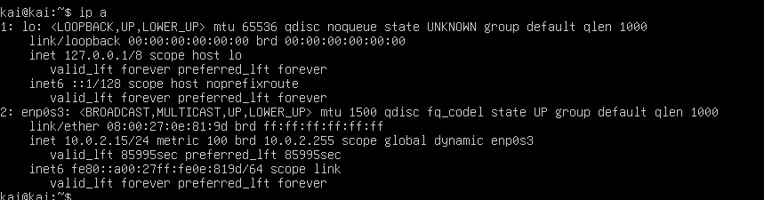

#  servidor DNS

Para configurar un servidor DNS con Bind9 se deben realizar los siguientes pasos:

#### **1. Actualizar el sistema**
Primero, asegúrate de que el sistema está actualizado:
```bash
sudo apt update
sudo apt upgrade
```

Esto garantiza que todas las dependencias del sistema estén al día.


#### **2. Instalar Bind9 y un editor de texto**
Instala el servidor DNS (Bind9) y el editor `nano` para modificar archivos:
```bash
sudo apt install bind9 bind9-utils nano
```


#### **3. Verificar que Bind9 está funcionando**
Comprueba si el servicio de Bind9 está activo. Los errores o advertencias son normales ya que aún no hemos configurado nada:
```bash
systemctl status bind9
```


#### **4. Configurar el firewall**
Habilita el acceso al puerto que usa Bind9 en el firewall:
```bash
sudo ufw allow bind9
```
Esto debería devolver un mensaje como: **Rules updated**.


#### **5. Configurar Bind9**
Edita el archivo `/etc/bind/named.conf.options`:
```bash
sudo nano /etc/bind/named.conf.options
```

Cambia o agrega las siguientes líneas:
```conf
listen-on { any; };              # Escucha en todas las interfaces.
allow-query { localhost; 10.10.20.0/24; }; # Permite consultas desde tu red interna.
forwarders {
    8.8.8.8;                     # Servidor DNS de Google.
    8.8.4.4;                     # Servidor DNS de Google.
};
dnssec-validation no;            # Desactiva la validación DNSSEC.
```

- **`listen-on { any; };`**: Indica que Bind9 estará escuchando en todas las interfaces de red.
- **`allow-query { localhost; 10.0.2.5/24; };`**: Permite que solo tu red local (10.10.20.x) haga consultas al servidor.
- **`forwarders`**: Servidores DNS externos (en este caso, los de Google) a los que Bind9 reenviará consultas que no pueda resolver.
- **`dnssec-validation no;`**: Desactiva la validación de DNSSEC (útil para configuraciones internas).

Guarda los cambios y cierra el editor (`Ctrl+O`, luego `Ctrl+X`).


#### **6. Forzar IPv4**
Edita el archivo `/etc/default/named`:
```bash
sudo nano /etc/default/named
```

Modifica esta línea para forzar el uso de IPv4:
```conf
OPTIONS="-u bind -4"
```


Guarda y cierra el archivo.


#### **7. Verificar configuración**
Verifica si la configuración de Bind9 es correcta y reinicia el servicio:
```bash
sudo named-checkconf
sudo systemctl restart bind9
systemctl status bind9
```


#### **8. Configurar zonas DNS**
Edita el archivo `/etc/bind/named.conf.local`:
```bash
sudo nano /etc/bind/named.conf.local
```


Agrega estas zonas:
```conf
zone "lamp.com" IN {
    type master;
    file "/etc/bind/zonas/db.lamp.com";
};

zone "20.10.10.in-addr.arpa" {
    type master;
    file "/etc/bind/zonas/db.10.10.20";
};

```

- **Zona directa (`lamp.com`)**: Resuelve nombres de dominio a direcciones IP.
- **Zona inversa (`20.10.10.in-addr.arpa`)**: Resuelve direcciones IP a nombres de dominio.




#### **9. Crear archivos de zona**
Primero, crea el directorio para los archivos de zona:
```bash
sudo mkdir /etc/bind/zonas
```


##### Crear la zona directa
Edita `/etc/bind/zonas/db.lamp.com`:
```bash
sudo nano /etc/bind/zonas/db.lamp.com
```

Contenido del archivo:
```conf
$TTL    1D
@       IN      SOA     kai.lamp.com. admin.lamp.com. (
        1               ; Serial
        12h             ; Refresh
        15m             ; Retry
        3w              ; Expire
        2h  )           ; Negative Cache TTL

        IN      NS      kai.lamp.com.
kai     IN      A       10.10.20.13
www     IN      A       10.10.20.13
```

- **`kai.lamp.com.`**: Servidor principal.
- **`admin.lamp.com.`**: Correo del administrador (usa un punto en lugar de `@`).


##### Crear la zona inversa
Edita `/etc/bind/zonas/db.10.10.20`:
```bash
sudo nano /etc/bind/zonas/db.10.10.20
```

Contenido del archivo:
```conf
$TTL    1D
@       IN      SOA     kai.lamp.com. admin.lamp.com. (
        1               ; Serial
        12h             ; Refresh
        15m             ; Retry
        3w              ; Expire
        2h  )           ; Negative Cache TTL

        IN      NS      kai.lamp.com.
1       IN      PTR     www.lamp.com.
```


#### **10. Verificar archivos de zona**
Comprueba que no haya errores en los archivos de zona:
```bash
sudo named-checkzone lamp.com /etc/bind/zonas/db.lamp.com
sudo named-checkzone 20.10.10.in-addr.arpa /etc/bind/zonas/db.10.10.20
```

Si todo está bien, obtendrás un **OK**.


#### **11. Reiniciar Bind9**
Reinicia el servicio de Bind9:
```bash
sudo systemctl restart bind9
```


#### **12. Probar la configuración**
Desde otro equipo, intenta hacer ping al dominio configurado:
```bash
ping www.lamp.com
```

