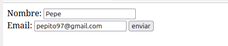
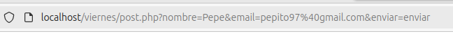

## Documenta en Github los métodos de paso de variables de formularios GET y POST enumerando los pasos a realizar. El documento debe tener un ejemplo de paso de dichas variables.

Cuando un usuario rellena un formulario en una página web los datos hay que enviarlos de alguna manera. Existen dos formas de envío de datos posibles: usando el método POST o usando el método GET. AMbos son métodos del protocolo HTTP, el cual está compuesto po un envío al servidor, conocido como petición, y una respuesta a dicha solicitud.

Las similitudes y las diferencias son los siguientes:

## GET

lleva los datos de forma "visible" al cliente (navegador web). El medio de envío es la URL y los datos los puede ver cualquiera.
Por ejemplo:
www.paginaweb.com/action.php?nombre=pepe&apellidos1=rodriguez
La longitud de la petición de GET está limitada.
Se pasa información al servidor en forma de atributo-valor, o añadiendo al final de la URL detrás de un símbolo de interrogación.

## POST

POST consiste en datos "ocultos" (porque el cliente no los ve) enviados por un formulario cuyo método de envío es post. Es adecuado para formularios. Los datos no son visibles.
Se puede utilizar para pasar información al servidor: en forma de pares atributo-valor o incluidos en el cuerpo de la petición. Este método no tiene limitación de espacio y se puede enviar mucha más información al servidor.

# Prueba con método GET.

1. En primer lugar debemos tener abierto XAMPP, utilizando el comando que anteriormente hemos utilizado.

Y encendemos los servidores.

2. Escribimos un formulario en un archivo **index**.php.

3. Creamos otro archivo, por ejemplo get-post.php
Método get:
EN primer lugar, para indicar el método, tenemos que poner en el formulario la etiqueta method="GET"

Y la etiqueta action="nombre.php.php" tenemos que poner el nombre del archivo en el que tenemos el código php, ya que los datos del formulario serán enviados a este cuando le demos al botón de enviar.

En el archivo PHP usamos la variable $_GET para conseguir el valor de la cadena de la consulta, como por ejemplo:
Ponemos el nombre del dato que queremos que recupere.

4. Ahora, escribimos en el navegador localhost/ seguido de la ubicación del archivo index, por ejemplo:

5. Nos saldrá el formulario. Ahora, rellenamos la información y le damos al botón de enviar.

6. Nos redirigirá al documento get.php donde veremos los datos que hemos sacado del formulario.

Pero hay que tener en cuenta que también se ven los datos en la url.

# Prueba con método POST.

1. De nuevo, tenemos que tener abierto el XAMPP y los servidores activos.
2. La creación del formulario es lo mismo, excepto que esta vez, cambiamos el valor de la etiqueta method, y en lugar de get, escribimos POST.
Esta vez, vamos a utilizar un input de subida de archivos.

3. EN el otro archivo php, lo único que cambia, es que la variable para conseguir la cadena de la consulta es $_POST.

Algunas aclaraciones:
- La etiqueta **pre** sirve para mantener el formato de los datos impresos en HTML.
- Se hace uso del **echo** para hacer uso de las etiquetas html, como por ejemplo **br**
- EL **($_FILES ['fichero']['name']);** imprime el nombre del fichero, y name accede al campo name en el fihcero.

4. Escribimos la localización del index en el navegador como hicimos anteriormente.

5. Nos aparecerá el formulario. Rellenamos y seleccionamos un archivo.

6. Y vemos cómo nos da la información que solicitamos. Esta vez, sin mostrar los datos en la URL.

