## Alojar Formulario en infinityFree
Para alojar el formulario en infinityFree, necesitarás seguir los siguientes pasos:
1.  Crea una cuenta en infinityFree y selecciona el plan gratuito.
Yo ya tenía cuenta por el curso pasado.

2. Damos click en create Account para crear un nuevo sitio web y le ponemos un nombre.

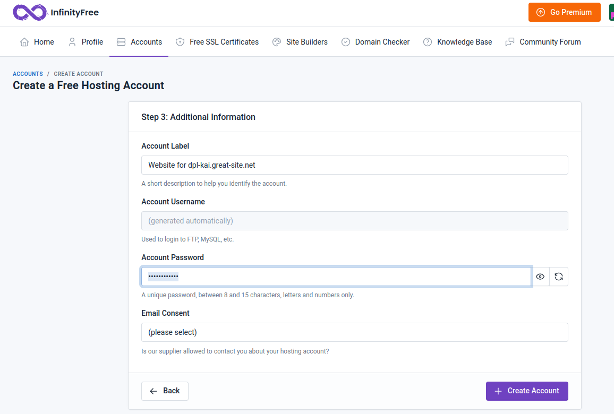
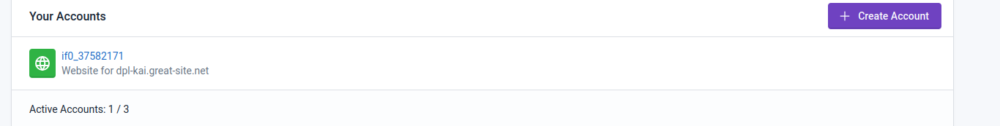

3. Tenemos que descargar (`apt install filezilla`), y abrir Filezilla e introducir el nombre de usuario y contraseña de infinityFree, además del puerto y del servidor. Esta información se encuentra en nuestra cuenta de infinityFree. Tanto en FTP details como en FILEMANAGER tenemos esta información.
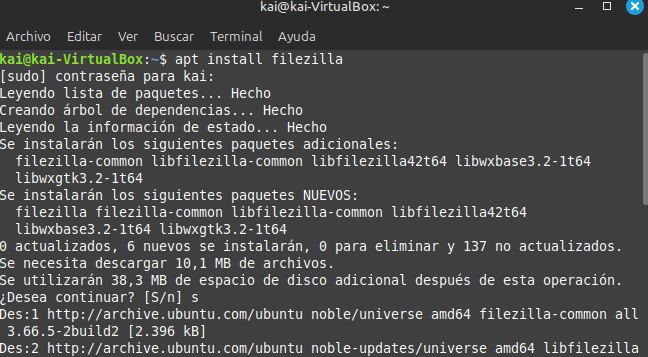
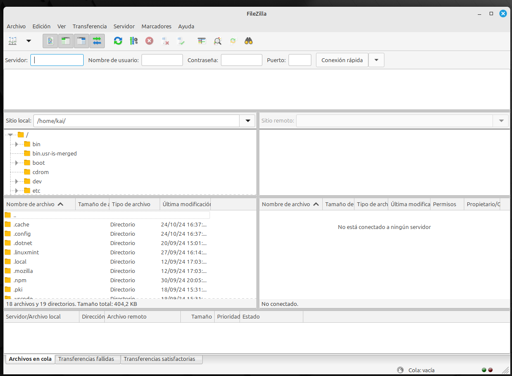
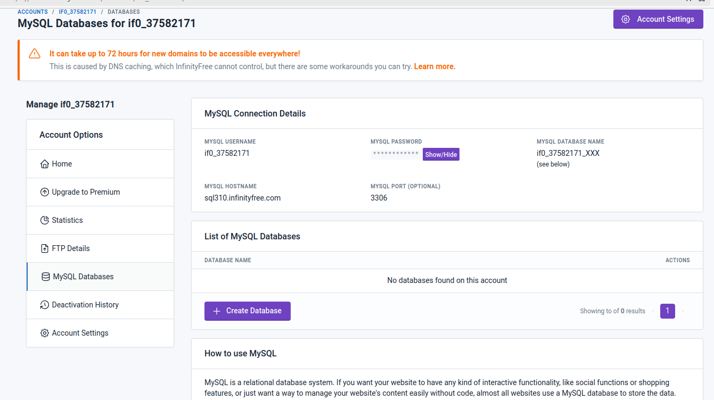
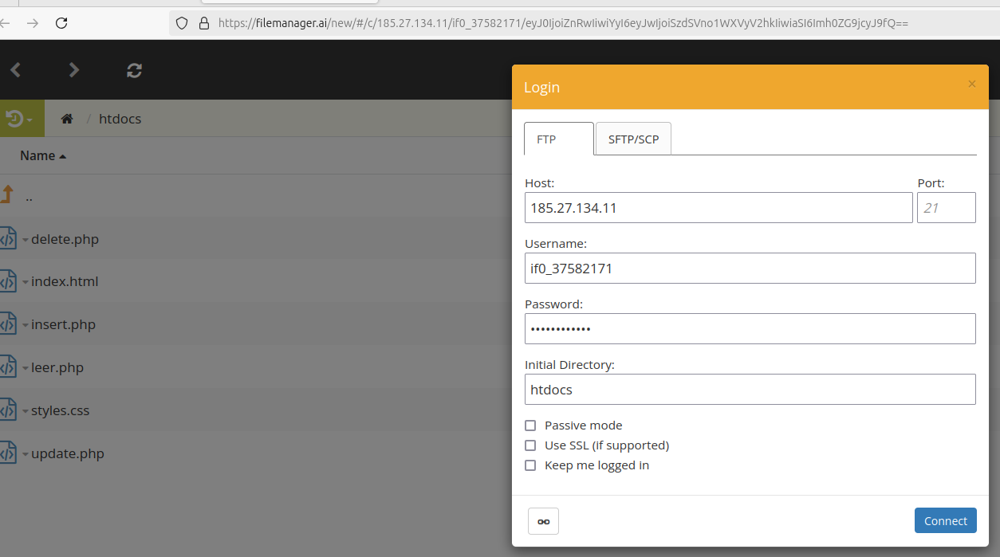
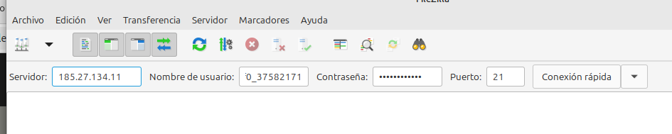

4. Crear una nueva base de datos. Para ello, en nuestra cuenta de infinityFree, seleccionamos Databases y luego Create Database.

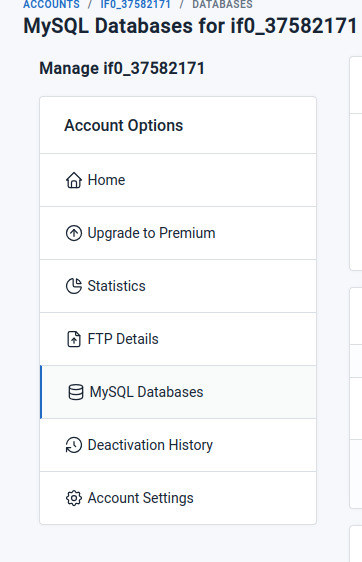

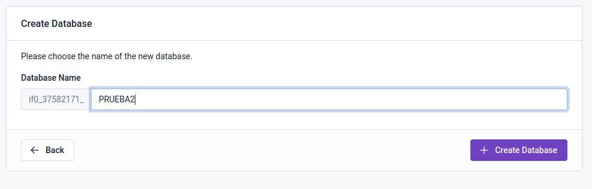
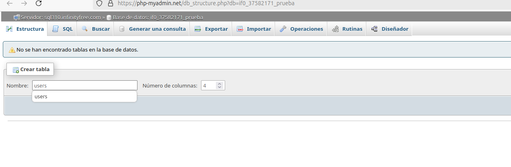
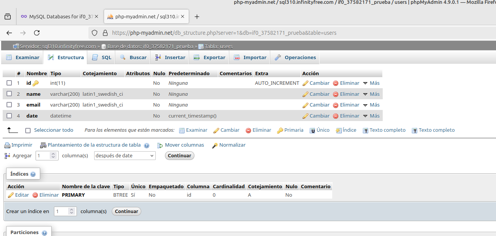

5. Conectar con la base de datos. Tenemos que modificar los archivos para cambiar la conexión a la base de datos. 
En primer lugar, tenemos que poner el servidor de infinityfree, en segundo lugar, nuestra cuenta de usuario.  En tercer lugar, la contraseña de nuestra cuenta de usuario. En cuarto lugar, el nombre de  la base de datos que creamos. En quinto lugar, el nombre de la tabla de la base de datos:

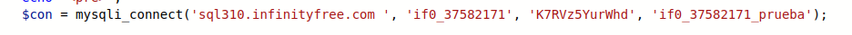

6. Probamos que funcione. Accedemos a nuestro sitio web:
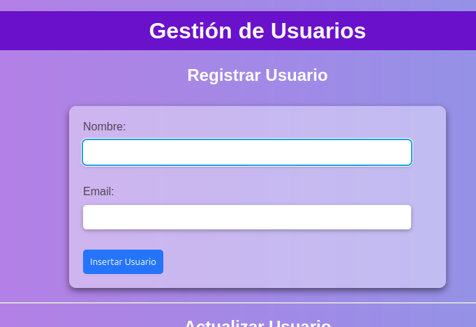
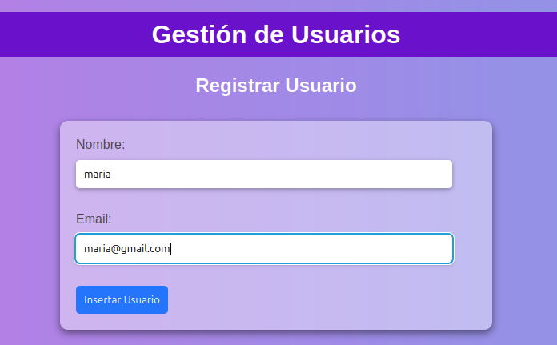
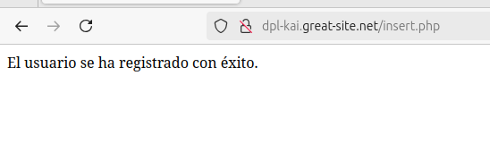
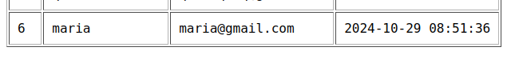

Funciona correctamente.