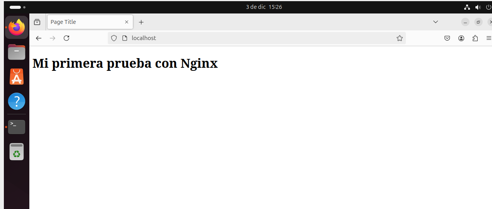

# Instalación y COnfiguración básica de Nginx

### 1. **Actualizar el sistema e instalar Nginx**
```bash
sudo apt update
apt install nginx
```
- **`sudo apt update`**: Actualiza la lista de paquetes disponibles y sus versiones.
- **`apt install nginx`**: Instala el servidor web **Nginx** desde los repositorios oficiales.

---

### 2. **Verificar el estado de Nginx**
```bash
systemctl status nginx
```
- **`systemctl status nginx`**: Muestra el estado del servicio Nginx (si está activo, corriendo, detenido, etc.).

---

### 3. **Comprobar la configuración de Nginx**
```bash
nginx -t
```
- **`nginx -t`**: Valida los archivos de configuración de Nginx para asegurarse de que no hay errores.

---

### 4. **Navegar por la configuración de Nginx**
```bash
cd /etc/nginx
ls
```
- **`cd /etc/nginx`**: Accede al directorio principal donde se encuentran los archivos de configuración de Nginx.
- **`ls`**: Lista los archivos y carpetas. Una carpeta importante aquí es **`sites-available`**, donde están las configuraciones de los sitios.

---

### 5. **Explorar los sitios configurados**
```bash
cd sites-available
ls
```
- **`cd sites-available`**: Entra al directorio **`sites-available`**, que contiene los archivos de configuración de los sitios virtuales.
- **`ls`**: Lista los archivos dentro de este directorio. El archivo predeterminado es **`default`**, que define cómo Nginx sirve contenido inicialmente.

```bash
cd sites-enabled
ls -l
```
- **`cd sites-enabled`**: Este directorio contiene enlaces simbólicos (shortcuts) a los archivos de configuración activos en **`sites-available`**.
- **`ls -l`**: Lista los archivos con detalles. Verás que **`default`** está enlazado a **`../sites-available/default`**.

---

### 6. **Inspeccionar el archivo de configuración predeterminado**
```bash
cat default
```
- **`cat default`**: Muestra el contenido del archivo **default**. Este archivo define dónde están los archivos HTML que se sirven, por defecto en **`/var/www/html`**.

---

### 7. **Modificar los archivos servidos**
```bash
cd /var/www/html
ls -l
```
- **`cd /var/www/html`**: Entra al directorio donde Nginx sirve los archivos web.
- **`ls -l`**: Lista los archivos en este directorio. Verás un archivo llamado **`index.nginx-debian.html`**, que es la página predeterminada.

```bash
rm index.nginx-debian.html
```
- **`sudo rm index.nginx-debian.html`**: Borra el archivo predeterminado para que puedas reemplazarlo.

---

### 8. **Crear tu propia página**
```bash
nano index.html
```
- **`nano index.html`**: Abre el editor **nano** para crear un nuevo archivo llamado **`index.html`**. Escribe algo como:
  ```html
  <html>
  <head>
    <title>Mi sitio</title>
    </head>
  <body>
    <h1>Mi primera prueba con Nginx</h1>
    </body>
  </html>
  ```
- Guarda y cierra presionando **Ctrl+O**, Enter y luego **Ctrl+X**.

---

### 9. **Reiniciar Nginx**
```bash
systemctl restart nginx
systemctl status nginx
```
- **`systemctl restart nginx`**: Reinicia Nginx para aplicar los cambios.
- **`systemctl status nginx`**: Verifica que Nginx esté corriendo correctamente.

---

### 10. **Probar en el navegador**
- Abre tu navegador web y visita **`http://localhost`**.
- Deberías ver el contenido de tu nuevo archivo **`index.html`**.


---
