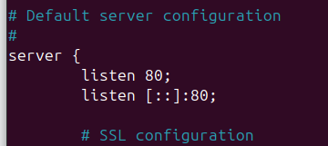
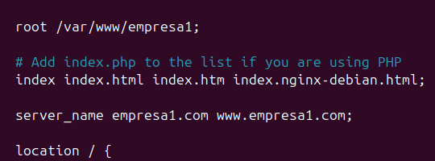
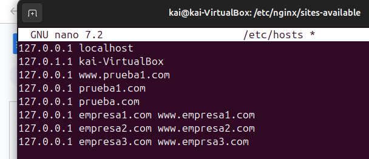

### **1. Crear directorios para cada sitio web**
```bash
mkdir -p /var/www/empresa1
mkdir -p /var/www/empresa2
mkdir -p /var/www/empresa3
```
- Estamos creando un directorio para cada sitio web dentro de `/var/www`, que es el lugar típico para almacenar páginas web en servidores Linux.
- **Por qué usamos `-p`?**
  Esto asegura que los directorios se creen incluso si alguno de los niveles superiores no existe.

---

### **2. Configurar permisos para los directorios**
```bash
chown -R usuario:usuario /var/www/empresa1
chmod -R 755 /var/www/empresa1
```
(Lo mismo se hace para `empresa2` y `empresa3`.)

- **¿Qué hace `chown`?**
  Cambia el propietario de los directorios y archivos a un usuario específico (`usuario:usuario`). Esto asegura que el usuario tenga control sobre estos directorios.

- **¿Qué hace `chmod 755`?**
  Asigna permisos:
  - **7 (rwx)**: El propietario (usuario) puede leer, escribir y ejecutar.
  - **5 (r-x)**: Otros usuarios pueden leer y ejecutar, pero no escribir.
  Esto es ideal para sitios web: los archivos pueden leerse públicamente, pero no modificarse.

---

### **3. Configurar los archivos de configuración de Nginx**
#### a) Ir al directorio de configuración de Nginx
```bash
cd /etc/nginx/sites-available
```
- **¿Qué es `sites-available`?**
  Es donde se guardan las configuraciones de los sitios. Cada archivo aquí describe cómo debe comportarse un sitio web específico.

#### b) Crear archivos de configuración para cada sitio
```bash
cp default empresa1
cp default empresa2
cp default empresa3
```
- **¿Por qué copiamos `default`?**
  Es un archivo de configuración de ejemplo incluido con Nginx. Lo usamos como base para configurar nuestros sitios.

#### c) Editar los archivos para personalizarlos
```bash
nano empresa1
```
Realizamos estos cambios:
1. **Quitar `default_server`**
   ```nginx
   listen 80;
   listen [::]:80;
   ```
   - Esto asegura que este sitio no sea el predeterminado para el servidor.



2. **Cambiar la raíz del documento**
   ```nginx
   root /var/www/empresa1;
   ```
   - Cambiamos la ruta donde Nginx buscará los archivos para este sitio.

3. **Configurar el nombre del servidor**
   ```nginx
   server_name empresa1.com www.empresa1.com;
   ```
   - Esto especifica qué nombres de dominio deben apuntar a este sitio.

Repite estos cambios en los archivos `empresa2` y `empresa3`, ajustando los nombres de dominio y las rutas de los directorios.



---

### **4. Habilitar los sitios en Nginx**
```bash
ln -s /etc/nginx/sites-available/empresa1 /etc/nginx/sites-enabled/
ln -s /etc/nginx/sites-available/empresa2 /etc/nginx/sites-enabled/
ln -s /etc/nginx/sites-available/empresa3 /etc/nginx/sites-enabled/
```
- **¿Qué hace `ln -s`?**
  Crea un enlace simbólico entre los archivos en `sites-available` y `sites-enabled`. Esto es como "activar" los sitios.

#### Verificar configuración y recargar Nginx
```bash
nginx -t
nginx -s reload
```
- **`nginx -t`**: Verifica si la configuración tiene errores.
- **`nginx -s reload`**: Recarga la configuración sin detener el servidor.

---

### **5. Configurar el archivo `/etc/hosts`**
```bash
nano /etc/hosts
```
Añadimos estas líneas:
```
127.0.0.1 empresa1.com www.empresa1.com
127.0.0.1 empresa2.com www.empresa2.com
127.0.0.1 empresa3.com www.empresa3.com
```
- **¿Qué hace `/etc/hosts`?**
  Este archivo asigna nombres de dominio a direcciones IP localmente. Al apuntar `empresa1.com` a `127.0.0.1`, le estamos diciendo a nuestra computadora que esos dominios deben resolverse localmente.


---

### **6. Crear páginas de prueba**
Para asegurarnos de que los sitios funcionen:
1. Navega a cada directorio:
   ```bash
   cd /var/www/empresa1
   nano index.html
   ```
2. Escribe algo como:
   ```html
   <h1>Hola, soy empresa1</h1>
   ```
3. Repite para `empresa2` y `empresa3`.

---

### **7. Probar los sitios**
1. Recarga Nginx:
   ```bash
   nginx -s reload
   ```
2. Abre un navegador y escribe:
   - `http://empresa1.com`
   - `http://empresa2.com`
   - `http://empresa3.com`

Deberías ver los mensajes correspondientes para cada sitio.


---
