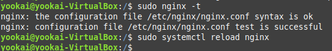

### **1. Generar un certificado autofirmado para cada dominio**
Vamos a generar una clave privada y un certificado autofirmado para cada dominio.

#### Para `empresa1.com`:
```bash
sudo openssl req -x509 -nodes -days 365 -newkey rsa:2048 -keyout /etc/ssl/private/empresa1.key -out /etc/ssl/certs/empresa1.crt
```

#### Parámetros explicados:
- **`-x509`**: Crea un certificado X.509 (autofirmado).
- **`-nodes`**: No cifra la clave privada (opcional).
- **`-days 365`**: El certificado será válido por 1 año.
- **`-newkey rsa:2048`**: Crea una clave RSA de 2048 bits.
- **`-keyout`**: Especifica el archivo para la clave privada.
- **`-out`**: Especifica el archivo para el certificado.

Completa la información solicitada, como nombre de la organización y país. Para **Common Name**, usa `empresa1.com`.


Repite este comando para `empresa2.com` y `empresa3.com`, ajustando los nombres de los archivos.

#### Para `empresa2.com`:
```bash
sudo openssl req -x509 -nodes -days 365 -newkey rsa:2048 -keyout /etc/ssl/private/empresa2.key -out /etc/ssl/certs/empresa2.crt
```

#### Para `empresa3.com`:
```bash
sudo openssl req -x509 -nodes -days 365 -newkey rsa:2048 -keyout /etc/ssl/private/empresa3.key -out /etc/ssl/certs/empresa3.crt
```

---

### **2. Configurar los archivos de host virtual en Nginx**
Edita los archivos de configuración de los hosts virtuales para usar los certificados SSL.

#### Para `empresa1.com`:
Edita el archivo `/etc/nginx/sites-available/empresa1`:
```bash
sudo nano /etc/nginx/sites-available/empresa1
```

Actualiza el contenido para incluir la configuración SSL:
```nginx
server {
    listen 80;
    server_name empresa1.com www.empresa1.com;
    return 301 https://$host$request_uri; # Redirige tráfico HTTP a HTTPS
}

server {
    listen 443 ssl;
    server_name empresa1.com www.empresa1.com;

    ssl_certificate /etc/ssl/certs/empresa1.crt;
    ssl_certificate_key /etc/ssl/private/empresa1.key;

    root /var/www/empresa1;
    index index.html index.htm;

    location / {
        try_files $uri $uri/ =404;
    }
}
```

#### Para `empresa2.com` y `empresa3.com`:
Repite el mismo proceso para los archivos `/etc/nginx/sites-available/empresa2` y `/etc/nginx/sites-available/empresa3`, asegurándote de usar los certificados y claves correspondientes a cada dominio.

---

### **3. Verificar la configuración de Nginx**
Asegúrate de que no haya errores en la configuración:
```bash
sudo nginx -t
```

Si todo está correcto, recarga Nginx:
```bash
sudo systemctl reload nginx
```




### **4. Probar los sitios**
1. Abre un navegador y accede a los dominios configurados:
   - `https://empresa1.com`
   - `https://empresa2.com`
   - `https://empresa3.com`
2. Es posible que veas un aviso de "sitio no seguro". Esto ocurre porque el certificado autofirmado no está emitido por una autoridad de confianza. Puedes aceptarlo manualmente para continuar.

