# Instalación y COnfiguración de VSFTPD

1- Limpiamos todo lo que podamos haber hecho anteriormente, en caso de haber intentado hacer esto anteriormente y comenzamos desde cero.

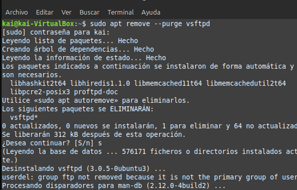

2- Instalamos el paquete vsftpd:

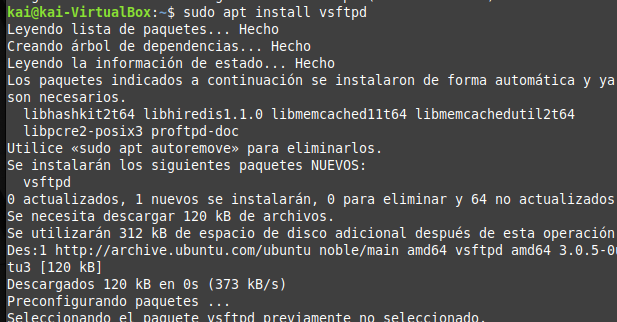

3- COmprobamos el estado del servidor:

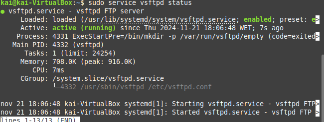

4- Buscamos la ip inet:

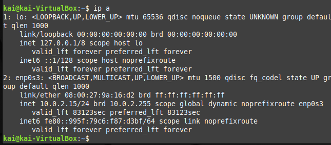

5- Ahora, tenemos que entrar al archivo de configuración y escribir lo siguiente, utilizando la ip que sacamos anteriormente para que el servidor sepa a que ip tiene que atender. En este caso como el cliente tiene la misma que el servidor al ser una máquina virtual, escribo el mismo.
Para acceder al archivo escribimos:

`sudo nano /etc/netplan/00-installer-config.yaml`

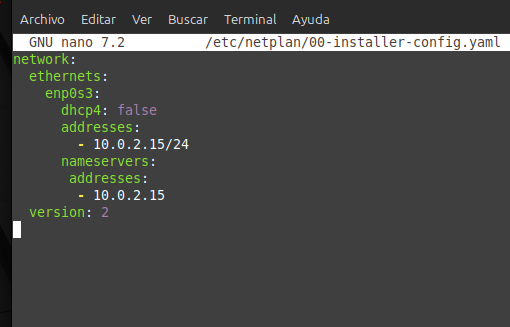

6- Aplicamos los cambios con `sudo netplan apply`
NOs da unos avisos pero realiza los cambios.

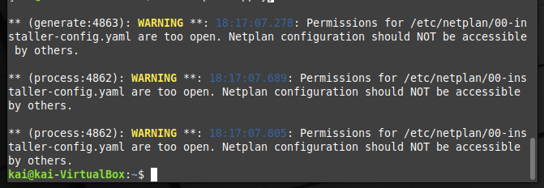

## COnfiguración

Es importante poner la red en red interna en el servidor y en el cliente antes de realizar estos pasos.

Lo primero que hacemos es cambiar el NO por el YES para permitir a los usuarios anónimos conectarse.

También es importante escribir 
`anon_root=/srv/ftp/anonimo`

Y ahora con la IP y el usuario anonymous deberíamos poder conectarnos en filezilla.

7- Ahora tenemos que modificar de nuevo la configuración.

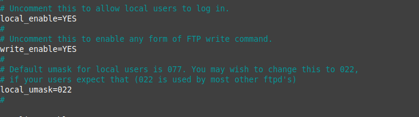

Nos conectamos con nuestro usuario administrador en filezilla:

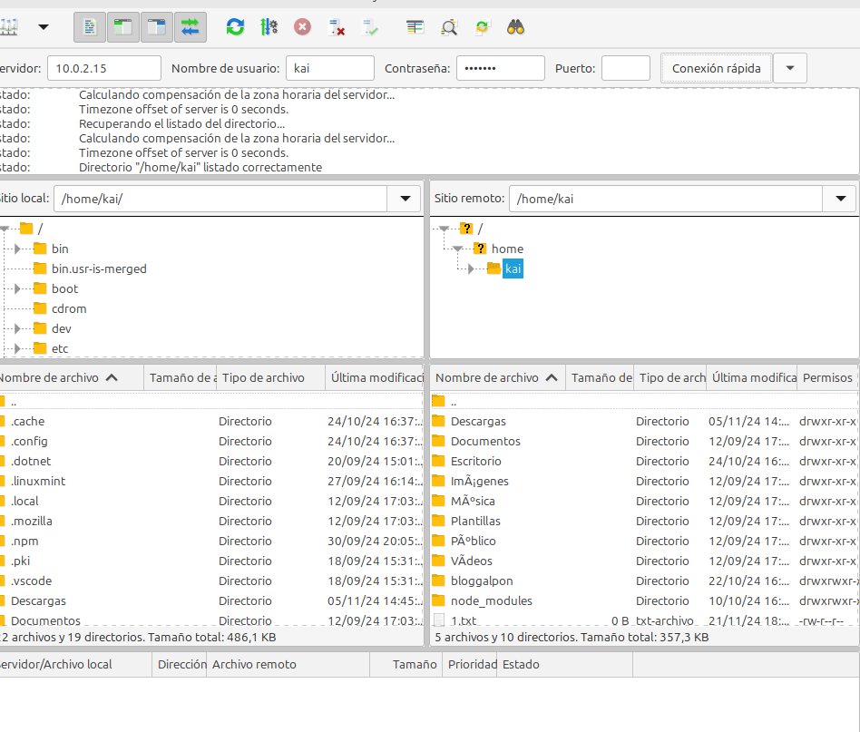

Vemos que podemos entrar y mover y los archivos. Por ejemplo, movemos el archivo administrador.txt

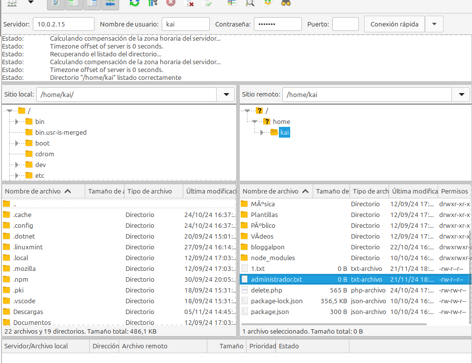

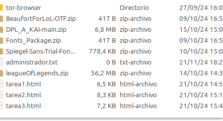

## Usuarios
Creamos un usuario, por ejemplo llamado mika, el nombre de uno de mis perros, con `adduser mika`

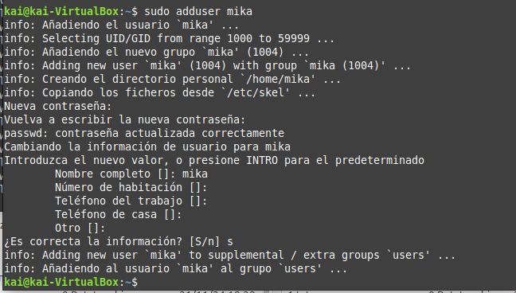

Vemos que el usuario se ha creado correctamente con el comando:

`cat /etc/passwd`

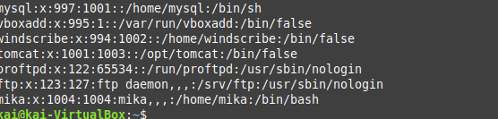

Modificamos el archivo de configuración de nuevo:

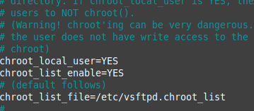

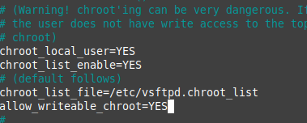

Tenemod que crear este fichero porque no lo crea automáticamente, para guardar a los usuarios.

Añadimos el nombre de los usuarios que queramos que tengan permiso para moverse libremente en el servidor, como el administrador.

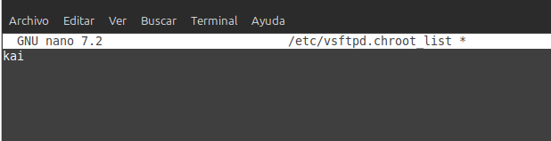

Hacemos un restart para guardar los cambios y comprobamos el estatus del servidor:

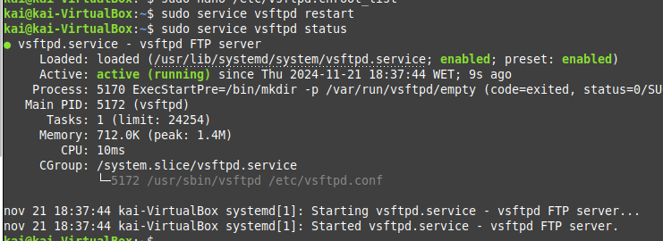

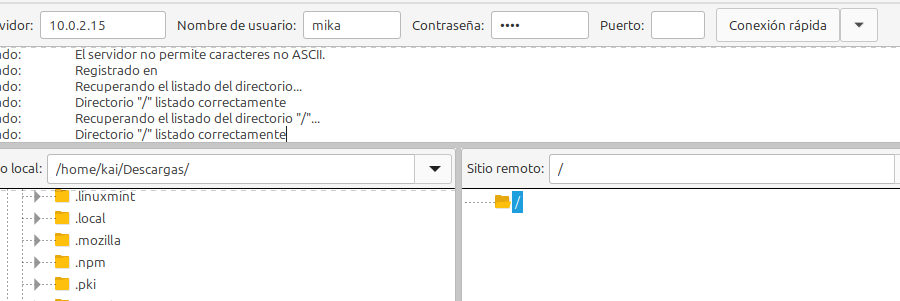