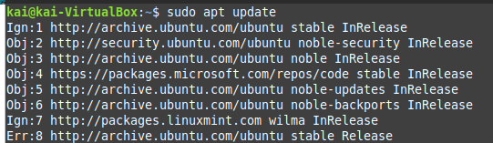

# 1. Instalación de ProFTPD

1. **Actualiza los paquetes disponibles**:
    ```bash
    sudo apt update
    ```


2. **Instala ProFTPD**:
    ```bash
    sudo apt install proftpd
    ```
Durante la instalación, selecciona "independiente" (*standalone*) si se te pregunta.

3. **Verifica que el servicio esté activo**:
    ```bash
    sudo systemctl status proftpd
    ```


Debe aparecer como `active (running)`.


---

## 2. Verificación inicial

1. **Revisa la versión de ProFTPD**:
    ```bash
    proftpd -v
    ```


2. **Usuarios creados durante la instalación**:
    ```bash
    cat /etc/passwd
    ```
Los usuarios creados serán `proftpd` y `nogroup`.


3. **Archivos generados en la instalación**:
    ```bash
    ls /etc/proftpd
    ```
    El archivo más importante es `proftpd.conf`.


4. **Haz una copia de seguridad de la configuración**:
    ```bash
    sudo cp /etc/proftpd/proftpd.conf /etc/proftpd/proftpd.conf.copia
    ```


---

## 3. Configuración del archivo `proftpd.conf`

1. **Edita el archivo de configuración**:
    ```bash
    sudo nano /etc/proftpd/proftpd.conf
    ```


2. **Cambia estas líneas importantes o añádelas si no existen**:
    ```text
    ServerName "Mi servidor FTP"
    DefaultRoot ~
    RequireValidShell off
    AccessGrantMSG "Bienvenido al servidor FTP de [tu_nombre]"
    AccessDenyMSG "Error de entrada a mi servidor FTP"
    ```


3. **Otras configuraciones importantes (déjalas como están si ya existen)**:
    ```text
    Port 21
    MaxInstances 30
    TimeoutIdle 1200
    User proftpd
    Group nogroup
    Umask 022 022
    TransferLog /var/log/proftpd/xferlog
    SystemLog /var/log/proftpd/proftpd.log
    ```


4. Guarda y cierra el archivo.

---

## 4. Reinicia el servicio

1. **Aplica la configuración**:
    ```bash
    sudo systemctl restart proftpd
    ```

2. **Verifica el estado del servicio**:
    ```bash
    sudo systemctl status proftpd
    ```


---

## 5. Crear usuarios virtuales

1. **Prepara el sistema para usuarios virtuales**:
    Edita el archivo de configuración y añade estas líneas:
    ```text
    AuthUserFile /etc/proftpd/ftpd.passwd
    RequireValidShell off
    DefaultRoot /var/ftp
    ```

2. **Crea un directorio para los usuarios FTP**:
    ```bash
    sudo mkdir -p /var/ftp/user1
    sudo chown -R proftpd:nogroup /var/ftp/user1
    ```

3. **Crea el archivo de usuarios virtuales**:
    ```bash
    sudo touch /etc/proftpd/ftpd.passwd
    ```

4. **Añade un usuario virtual**:
    Usa el comando `ftpasswd` para crear un usuario con acceso limitado:
    ```bash
    sudo ftpasswd --passwd --file=/etc/proftpd/ftpd.passwd --name=user1 --uid=1001 --gid=1001 --home=/var/ftp/user1 --shell=/bin/false
    ```

5. **Verifica que el archivo se haya creado correctamente**:
    ```bash
    cat /etc/proftpd/ftpd.passwd
    ```


---

## 6. Pruebas de conexión

1. **Desde terminal**:
    ```bash
    ftp <IP_DEL_SERVIDOR>
    ```
    Usa el nombre de usuario y contraseña creados. Prueba comandos como `ls`, `pwd`, y `quit`.

2. **Desde navegador web**:
    En la barra de direcciones, escribe:
    ```
    ftp://<IP_DEL_SERVIDOR>
    ```
    Ingresa el usuario y contraseña cuando se solicite.

3. **Desde FileZilla**:
    - Servidor: `<IP_DEL_SERVIDOR>`
    - Usuario: `user1`
    - Contraseña: la contraseña que configuraste
    - Puerto: `21`


---

## 7. Configurar restricciones de acceso

1. **Evitar que los usuarios salgan de su directorio**:
    En el archivo `proftpd.conf`, asegúrate de tener:
    ```text
    DefaultRoot ~
    ```

2. **Cambiar permisos predeterminados**:
    Ajusta el `Umask` para restringir permisos. Para archivos `rw_______` y directorios `drwx______`, usa:
    ```text
    Umask 077 077
    ```


3. **Aplica los cambios**:
    ```bash
    sudo systemctl reload proftpd
    ```


---

## 8. Revisar registros

1. **Ver los últimos accesos al servidor**:
    ```bash
    tail -n 15 /var/log/proftpd/proftpd.log
    ```


2. **Ver problemas de conexión**:
    ```bash
    tail -n 15 /var/log/proftpd/xferlog
    ```

