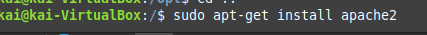
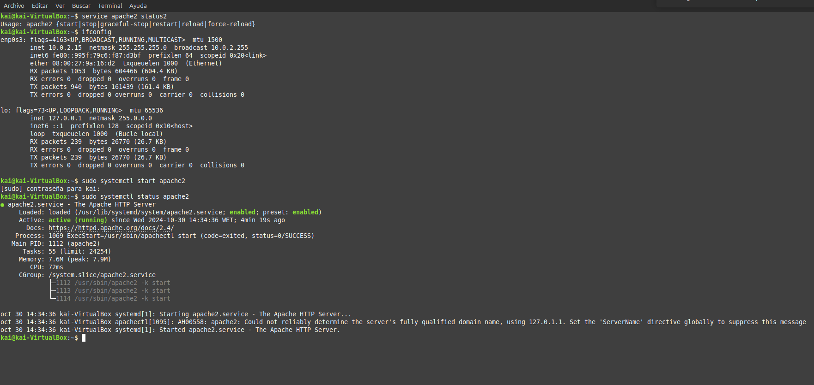
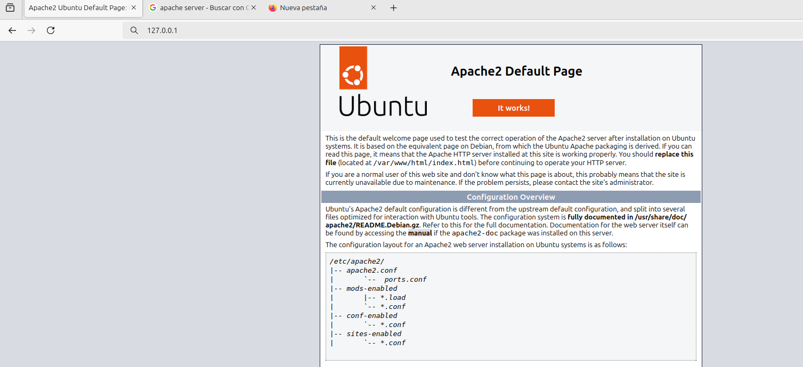
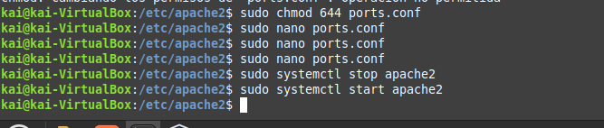
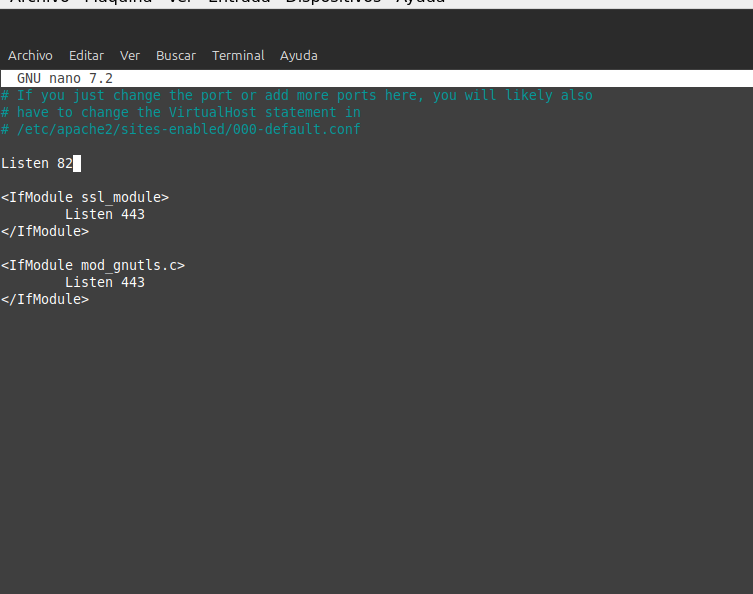
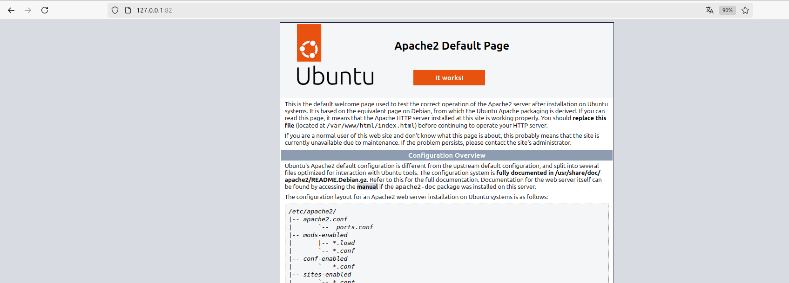
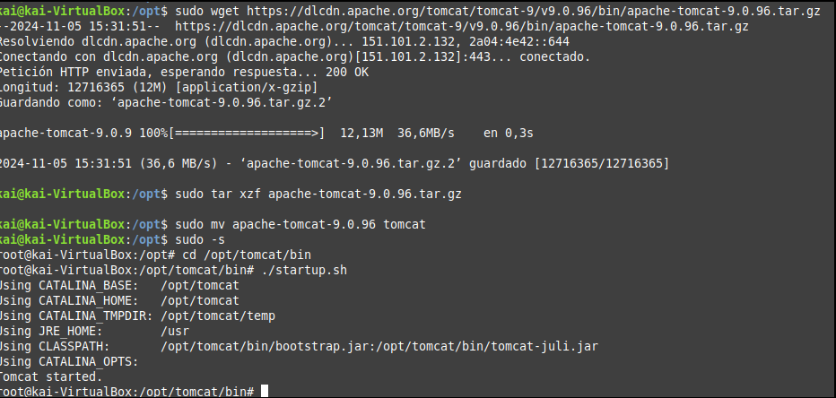
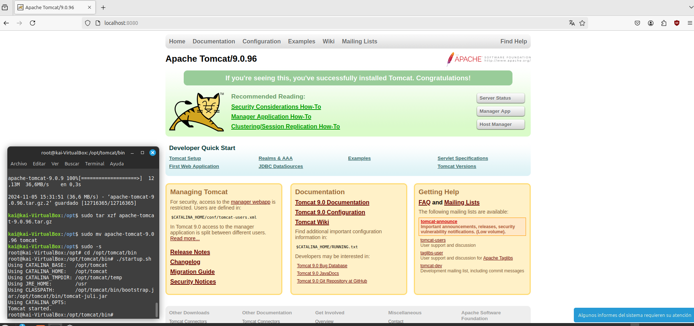

# Instalación de servidor web Apache

## La arquitectura Web es un modelo compuesto de tres capas, ¿cuáles son y cuál es la función de cada una de ellas?

La arquitectura web se organiza en tres capas principales, cada una con funciones específicas para garantizar una comunicación eficaz entre el usuario y la base de datos de la aplicación. Estas capas son:

- **Capa de presentación**: Es la interfaz visible para el usuario, generalmente accesible desde un navegador web. Su función es mostrar la información y permitir la interacción directa con la aplicación. Aquí es donde el usuario introduce sus datos, realiza acciones y recibe las respuestas de la aplicación.

- **Capa de lógica de negocio**: También conocida como capa de aplicación, contiene la lógica y reglas de la aplicación. Su función principal es procesar las solicitudes del usuario, gestionar las operaciones de la aplicación y coordinar el flujo de datos entre la capa de presentación y la capa de datos. Los servidores de aplicaciones suelen encontrarse en esta capa, interpretando las peticiones y gestionando las respuestas.

- **Capa de datos**: Es la capa encargada de almacenar y gestionar los datos de la aplicación. Incluye bases de datos o sistemas de almacenamiento donde se alojan la información y los datos necesarios para la aplicación. La capa de datos se comunica principalmente con la capa de lógica de negocio, proporcionando y almacenando la información que requiere el sistema.

## Una plataforma web es el entorno de desarrollo de software empleado para diseñar y ejecutar un sitio web; destacan dos plataformas web, LAMP y WISA. Explica en qué consiste cada una de ellas.

Una plataforma web se compone de un conjunto de tecnologías y herramientas que permiten diseñar, desarrollar, ejecutar y gestionar aplicaciones y sitios web. Entre las plataformas web más conocidas están **LAMP** y **WISA**, cada una con sus características y ventajas:

- **LAMP**: Es una pila de software de código abierto que incluye **Linux** como sistema operativo, **Apache** como servidor web, **MySQL** como sistema de gestión de bases de datos, y lenguajes de programación como **PHP, Python o Perl**. Esta plataforma es ampliamente utilizada debido a su flexibilidad, estabilidad y comunidad de soporte, además de su compatibilidad con diferentes sistemas operativos y su bajo coste.

- **WISA**: Esta pila está compuesta por tecnologías desarrolladas por Microsoft e incluye **Windows** como sistema operativo, **IIS (Internet Information Services)** como servidor web, **SQL Server** como sistema de gestión de bases de datos y **ASP.NET** como framework de desarrollo web. WISA se caracteriza por su facilidad de integración con otros productos de Microsoft y es muy utilizada en entornos empresariales donde ya existen infraestructuras de software de Microsoft.

# Apache

Descargamos apache con el siguiente comando:

`sudo apt-get install apache2`

2.Ahora comprobamos que esté funcionando correctamente con el comando: 

`service apache2 status`

Si aparece apagado,  lo activamos con el comando:
`sudo systemctl start apache2`
Y ya estaría encendido.

Con `ifconfig` obtenemos el ip de la máquina para acceder a la página principal de Apache. 
Ahora vamos al navegador y ponemos la IP como se ve de la siguiente manera:

Ahora procedemos, como dice la actividad, a cambiar el puerto.
Para esto, tenemos que entrar en la carpeta  `/etc/apache2/ports.conf` y cambiar el puerto 80 por el 82.
Primero hacemos:

`cd /etc/apache2`

Ahora tenemos que darle permiso para poder modificarlo:
`sudo chmod 644 ports.conf`

Y a continuación, lo abrimos con nano: `sudo nano ports.conf`

Se nos abriré el documento y cambiaremos  el puerto 80 por el 82. Guardamos, salimos, y reiniciamos apache.
`sudo systemctl stop apache2`
`sudo systemctl start apache2`
o, podemos  hacerlo de una manera más rápida con `sudo service apache2 restart`

Ahora entramos al navegador como antes, y vemos que utiliza el puerto que le hemos asignado.

# Tomcat

Para utilzar el tomcat, tenemos que tener descargado Java.
Lo instalamos usando `apt-get install default-jdk `

Luego, entramos a la carpeta opt.
`cd /opt`

 Y descargamos la carpeta de tomcat:

`sudo wget https://dlcdn.apache.org/tomcat/tomcat-9/v9.0.96/bin/apache-tomcat-9.0.96.tar.gz`

Descomprimimos y movemos la carpeta dentro de una llamada tomcat:

`sudo tar xzf apache-tomcat-9.0.96.tar.gz`

`sudo mv apache-tomcat-9.0.96 tomcat`

Ahora iniciamos Tomcat:

`sudo -s `

 Luego escribimos en la interfaz:

 `cd /opt/tomcat/bin`

 Y por último, lo inicializamos con:

`./startup.sh`

Ahora solo queda comprobar que funciona correctamente. Para ello, abrimos el navegador y entramos a `http://localhost:8080`. Se nos debería ver algo así:

