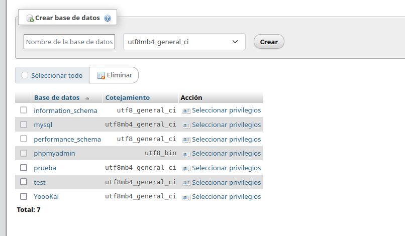
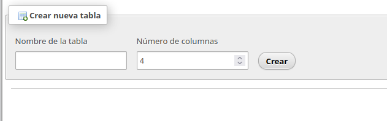
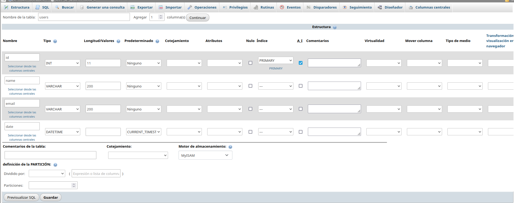
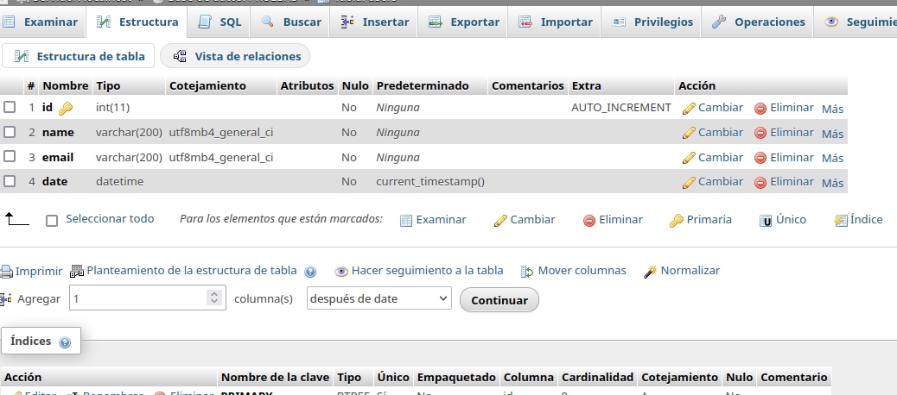
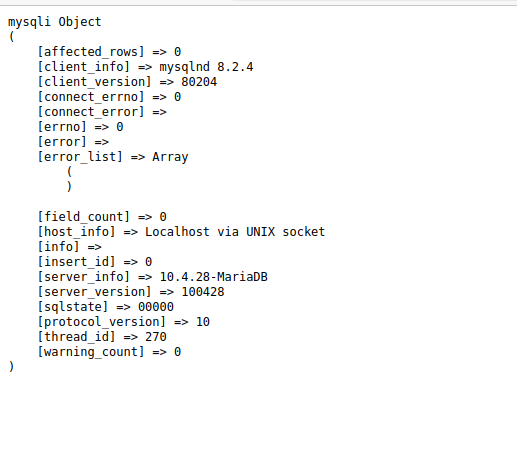

# Conexión a la Base de Datos
Creamos un nuevo fichero llamado `conexion.php`.

Realizamos una conexión con mysql utilizando la función `mysqli_connect()`.
Se deben pasar varios parámetros: 
el hostname del servidor, el username, la contraseña del servidor, y el nombre de la base de datos.
Como es un servidor local, le ponemos localhost como nombre de servidor. Si no, pondríamos una dirección IP.

Le asignamos una variable, y esto nos devolverá un identificador de conexión.

Sin embargo, como no existe la base de datos que le hemos pasado, va a dar un error. Así que tenemos que crear esta base de datos.

Para ello, tenemos que tener conectados los servidores con XAMPP abierto. En el navegador, ponemos localhost/ y pulsamos PHP my admin. Allí está la pestaña de Bases de datos, y tenemos la opción de crear una nueva.
Tenemos que darle un nombre y hacer click en "Crear". La llamaré 'PRUEBAS'.

A continuación, tenemos que crear una tabla. Le damos un nombre, en este caso users, y de nuevo, le damos a "Crear".

Ahora tenemos que indicar los campos de la tabla. En este caso, ponemos un id, tipo entero, que sea PRIMARY KEY, y sea autoincremental. Un nombre, tipo VARCHAR con longitud máxima de 200 caracteres, y un email con las mismos parámetros que el nombre. Por último, un "created at", que será de tipo DATETIME y le ponemos vomo valor predeterminado "CURRENT TIMESTAMP" para que se añada automáticamente. POr último, cambiamos el motor de almacenamiento a MyISAM, que es el más ligero. Y pulsamos en "Guardar"

Si vamos a la pestaña de Structure, podemos ver que se ha creado correctamente.

Ahora, al entrar a localhost/conexion.php, vemos que la conexión se ha establecido correctamente con la base de datos, y nos muestra lo siguiente:

