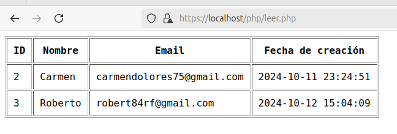

# Gestión de la base de datos usuarios mediante formulario.

- En primer lugar, se debe tener abierto el XAMPP y los servidores activos.
- La carpeta que contenga los ficheros con los que trabajaremos deben estar ubicados en htdocs, ubicada en: `/opt/lampp/htdocs`.
- Debemos de tener una base de datos creada en `localhost/myadmin` como habíamos hecho en los ejercicios anteriores.

# 1. Formulario para registrar al usuario:
En el fichero `index.html` creamos un formulario de registtro.

```html   
<h2>Registrar Usuario</h2>
    <form action="insert.php" method="POST">
        Nombre: <input type="text" name="name" required><br><br>
        Email: <input type="email" name="email" required><br><br>
        <input type="submit" value="Insertar Usuario">
    </form>
```   

Creamos un fichero, `insert.php`, que mediante el formulario creado usando el método POST, insertará los datos de los usuarios.

Este debe contener las sigguientes líneas:

```php
?php

//se establece la conexión con la base de datos. Le pasamos el servidor, el nombre de usuario, la contraseña del usuario, y el nombre de la base de datos.
$con = mysqli_connect('localhost', 'root', '', 'PRUEBA2');

//se comprueba la conexión.
//Si falla, se ejecuta die(), que muestra un mensaje con el error exacto que causó el fallo usando mysqli_connect_error(), y el script se detiene.
if (!$con) {
    die("Error de conexión: " . mysqli_connect_error());
}

//comprueba que el método del formulario sea POST para mayor seguridad.
if ($_SERVER['REQUEST_METHOD'] == 'POST') {

    //se guardan los valores que el usuario ingresó en los campos name y email del formulario HTML
    $name = $_POST['name'];
    $email = $_POST['email'];

    //se guarda en una variable una consulta SQL de tipo INSERT que va a añadir un nuevo registro en la tabla users.
    $insert = "INSERT INTO users(name, email) VALUES ('$name', '$email')";

    //mysqli_query() ejecuta la consulta SQL. Si la consulta fue exitosa, devolverá true, y ese valor se almacena en la variable $return.
    $return = mysqli_query($con, $insert);

    //verificar si la inserción fue exitosa. Si return es true, devuelve el mensaje de éxito, si no, muestra que ha habido un error, y el tipo de error usando mysqli_error($con) EL punto sirve para concatenar la cadena con la función.
    if ($return) {
        echo "El usuario se ha registrado con éxito.";
    } else {
        echo "Error al insertar: " . mysqli_error($con);
    }
}

//se cierra la conexión para liberar los recursos y mejorar el rendimiento.
mysqli_close($con);

?>
```

### Comprobamos su funcionamiento:


# 2. Formulario para actualizar datos de usuarios.

```html
 <h2>Actualizar Usuario</h2>
    <form action="update.php" method="POST">
        ID del usuario a actualizar: <input type="number" name="id" required><br><br>
        Nuevo nombre: <input type="text" name="name" required><br><br>
        Nuevo email: <input type="email" name="email" required><br><br>
        <input type="submit" value="Actualizar Usuario">
    </form>
```

Creamos un fichero, `update.php`, que mediante el formulario creado usando el método POST, cambiará los datos de los usuarios.

El código es muy similar al anterior, por lo que la explicación será más breve.

```php
<?php

//conexión con la base de datos
$con = mysqli_connect('localhost', 'root', '', 'PRUEBA2');

//comprobar conexión
if (!$con) {
    die("Error de conexión: " . mysqli_connect_error());
}

//comprobar método
if ($_SERVER['REQUEST_METHOD'] == 'POST') {
    // guardar los datos recibidos del formulario que necesitamos para la consulta
    $id = $_POST['id'];
    $name = $_POST['name'];
    $email = $_POST['email'];

    // utilizamos una consulta de tipo update con las variables recibidas para cambiar los datos donde el id del usuario sea el que nos han dado.
    $update = "UPDATE users SET name = '$name', email = '$email' WHERE id = $id";

    // se lleva a cabo la consulta
    $return = mysqli_query($con, $update);

    // verificar si ha funcionado, y devuelve mensaje de éxito o de error.
    if ($return) {
        echo "EL usuario se ha actualizado correctamente.";
    } else {
        echo "Error al actualizar: " . mysqli_error($con);
    }
}

// se cierra la conexión
mysqli_close($con);
?>

```

### Comprobamos su funcionamiento:


# Formulario para eliminar usuarios.

```html
<h2>Eliminar Usuario</h2>
    <form action="delete.php" method="POST">
        ID del usuario a eliminar: <input type="number" name="id" required><br><br>
        <input type="submit" value="Eliminar Usuario">
    </form>
```

Creamos un fichero, `delete.php`, que mediante el formulario creado usando el método POST, borrará los datos de los usuarios por su id.

```php
<?php

//establecer conexión
$con = mysqli_connect('localhost', 'root', '', 'PRUEBA2');

// comprobar la conexión
if (!$con) {
    die("Error de conexión: " . mysqli_connect_error());
}
//  comprobar método
if ($_SERVER['REQUEST_METHOD'] == 'POST') {
    // guardar el id que recibe el formulario
    $id = $_POST['id'];

    // consulta SQL de borrado 
    $delete = "DELETE FROM users WHERE id = $id";

    // realizar la consulta
    $return = mysqli_query($con, $delete);

    // comprobar si ha funcionado
    if ($return) {
        echo "El usuario ha sido borrado correctamente.";
    } else {
        echo "Error al borrar: " . mysqli_error($con);
    }
}

// cerrar la conexión
mysqli_close($con);

?>
```
### Comprobamos su funcionamiento:


# Botón para mostrar los datos.

```html
    <form action="leer.php" method="POST" class="no-style">
        <button type="submit" id="btn" >Mostrar Datos</button>
    </form>
```

Ahora creamos un archivo `leer.php` que mostrará los registros de la base de datos.

```php
<?php
echo "<pre>";

// conexión a la base de datos
$con = mysqli_connect('localhost', 'root', '', 'PRUEBA2');

// comprobar conexión
if (!$con) {
    die("Error de conexión: " . mysqli_connect_error());
}

// consulta SQL para obtener los datos de la tabla 'users'
$sql = "SELECT id, name, email, created_at FROM users";
//lanzar la consulta
$result = mysqli_query($con, $sql);

// comprobar si funcionó o no.
if (!$result) {
    die("Error en la consulta: " . mysqli_error($con));
}

//mysqli_num_rows($result) devuelve el número de filas encontradas.
// y así comprobamos que haya registros, es decir, filas en la base de datos mayor que 0
if (mysqli_num_rows($result) > 0) {
    // si hay datos, el código inicia una tabla HTML con un borde y espacio entre las celdas (border='1', cellpadding='10'). 
    //luego, se define una fila de encabezado (<th>) para las columnas de ID, Nombre, Email, y Fecha de creación.
    echo "<table border='1' cellpadding='10'>";
    echo "<tr><th>ID</th><th>Nombre</th><th>Email</th><th>Fecha de creación</th></tr>";

    // usa un bucle while para iterar sobre cada fila devuelta por la consulta. 
    //la función mysqli_fetch_assoc($result) obtiene una fila de resultados como un array asociativo (donde los nombres de los campos son las claves del array).
    while ($row = mysqli_fetch_assoc($result)) {
        //dentro del bucle, se crea una fila de la tabla (<tr>) y en cada celda (<td>) se muestra el valor de cada campo: id, name, email, y created_at.
        echo "<tr>";
        echo "<td>" . $row['id'] . "</td>";
        echo "<td>" . $row['name'] . "</td>";
        echo "<td>" . $row['email'] . "</td>";
        echo "<td>" . $row['created_at'] . "</td>";
        echo "</tr>";
    }

    // cierra la tabla HTML después de mostrar todos los resultados.
    echo "</table>";

// Si no hay filas en el resultado, es decir, la tabla está vacía, se muestra un mensaje que indica que no se encontraron datos.
} else {
    echo "No se encontraron datos en la tabla 'users'.";
}
//se cierra la conexión
mysqli_close($con);
?>

```

### Comprobamos su funcionamiento:




