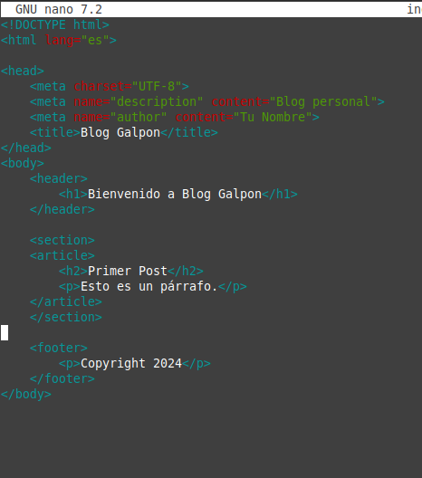

# Tarea 1.3- Trabajando con Git y Markdown 3

- Creo un directorio de trabajo llamado /bloggalpon/ en el directorio del usuario.

`mkdir bloggalpon && cd bloggalpon`

- Inicializar el repositorio vacío.

`git init`

- Crear el archivo index.htm

`touch index.html`

- Añadir la estructura básica de una web.


```bash
nano index.html
```
 ```html
<!DOCTYPE html>
<html lang="es">
<head>
    <meta charset="UTF-8">
    <meta name="viewport" content="width=device-width, initial-scale=1.0">
    <title></title>
</head>
<body>
    
</body>
</html>
 ```


- Crear un commit indicando que se crea el esqueleto básico del index.htm

```bash
git add index.htm
git commit -m "Se crea el esqueleto básico del index.htm"
```


- Añadir el contenido al head, entre `<head>` y `</head>`.

`nano index.html`

 ```html
<head>
    <meta charset="UTF-8">
    <meta name="description" content="Blog personal">
    <meta name="author" content="Tu Nombre">
    <title>Blog Galpon</title>
</head>


 ```
- Crear un commit indicando que se añade la cabecera del index.htm
 ```bash
git add index.htm
git commit -m "Se añade la cabecera del index.htm"
```


- Añadir el contenido al body, entre `<body>` y `</body>`
```html
<body>
    <header>
        <h1>Bienvenido a Blog Galpon</h1>
    </header>
    <section>
    </section>
    <footer>
        <p>Copyright 2024</p>
    </footer>
</body>
```


- Crear un commit indicando que se añade la estructura básica del body.

```bash
git add index.htm
git commit -m "Se añade la estructura básica del body"
```


- Añadir el contenido de section, entre <section> y </section>
```html
<section>
    <article>
        <h2>Primer Post</h2>
        <p>Esto es un párrafo.</p>
    </article>
</section>

```


- Crear un commit indicando que se añade toda la estructura de la zona de posts.
```bash
git add index.htm
git commit -m "Se añade toda la estructura de la zona de posts"
```
- Crear un archivo style.css.

```bash
touch style.css

nano style.css
```


- Añadir la siguiente información.
```css
html, body {
    margin: 0;
    padding: 0;
    font-family: Arial, sans-serif;
    background-color: #f9f9f9;
    line-height: 1.6;
}

body {
    max-width: 1200px;
    margin: 0 auto;
    padding: 20px;
}

```


- Crear un commit indicando que se añaden las CSS de html y de body.
```bash
git add style.css
git commit -m "Se añaden el CSS de html y de body"
```


- Añadir la siguiente información.
```css
header, section, article, aside, footer {
    margin: 0 auto;
    padding: 20px;
    border-radius: 5px;
}

header {
    background-color: #333;
    color: #fff;
    text-align: center;
    padding: 40px 0;
}

section {
    margin-top: 20px;
}

article {
    margin-bottom: 20px;
    background-color: #fff;
    box-shadow: 0 0 10px rgba(0, 0, 0, 0.1);
    padding: 20px;
}

footer {
    margin-top: 30px;
    background-color: #222;
    color: #ccc;
    text-align: center;
    padding: 10px 0;
}

```


- Crear un commit indicando que se añaden las CSS de varios elementos HTML5: header, section, article, aside y footer.

```bash
git add style.css
git commit -m "Se añaden el CSS de varios elementos HTML5: header, section, article, aside y footer"
```


- Añadir en el directorio raíz de proyecto el logotipo que aparecerá en la barra lateral izquierda: logo.png


- Crear un commit indicando que se añade el logotipo de Galpón.
```bash
git commit -m "Se añade el logotipo de Galpón"
```


- Añadir la siguiente información.
```css
section {
    padding: 20px;
    background-color: #f4f4f4;
}

```


- Crear un commit indicando que se añaden las CSS de section.

```bash
git add style.css
git commit -m "Se añade CSS de section"
```


- Añadir la siguiente información.
```css
footer{
    background-color: black;
    color: white;
    text-align: center;
    padding: 10px 10px;
    
}

```


- Crear un commit indicando que se añaden las CSS del footer.

```bash
git add style.css
git commit -m "Se añaden las CSS del footer"

```


- Añadir la siguiente información.
```css
h1 {
    font-size: 2.5em;
    color: #333;
}

a {
    color: #333;
    text-decoration: none;
}
```


- Crear un commit indicando que se añaden las CSS del H1 y de los enlaces.
```bash
git add style.css
git commit -m "Se añaden las CSS del H1 y de los enlaces"
```


- Crear una etiqueta de v1.0

```bash
git tag v1.0

```


- Crear una rama “desarrollo”. En esta rama de desarrollo vamos a realizar varias tareas:
```bash
git checkout -b desarrollo

```


- Crear un directorio de images y mover allí el logotipo logo.png.

```bash
mkdir img
mv logo.png img/
```


- Crear un commit indicando que se mueve el logotipo a la carpeta images.

```bash
git add img/logo.png
git commit -m "Se mueve el logotipo a la carpeta images"
```


- Crear un directorio de CSS y mover allí las CSS style.css.
```bash
mkdir css
mv style.css css/
```


- Crear un commit indicando que se mueve la CSS a la carpeta CSS.
```bash
git add css/style.css
git commit -m "Se mueve la CSS a la carpeta CSS"

```


- Cambiar las referencias a la CSS en el index.htm y al logotipo logo.png en la CSS.

```html
<link rel="stylesheet" href="css/style.css">
<!-- codigo anterior !-->
<div class="logo"></div>
```


- Crear un commit indicando que se cambian las referencias a las CSS y a las imágenes al reorganizarlas en directorios.
```bash
git add index.html
git commit -m "Se cambian las referencias a las CSS y a las imágenes al reorganizarlas en directorios"
```


- Crear una rama “bugfix” a partir de la “master” para resolver una serie de fallos.
```bash
git checkout master
git checkout -b bugfix

```


- Quitar los comentarios en las CSS de los dos punteados (empiezan por //border ).
```css

.sidebar {
    border-right: 2px dotted #ccc; 
}

footer {
    border-top: 2px dotted #ccc; 
}


```


- Crear un commit indicando que introducen los punteados en la barra derecha y en el footer.
```bash
git add css/style.css
git commit -m "Se introducen los punteados en la barra derecha y en el footer"
```


-  Introducir como título “Galpon”.
```html
<title>Galpon</title>

```


-  Crear un commit indicando que se introduce el título en la página.
```bash
git add index.html
git commit -m "Se introduce el título en la página"

```


- Cambiar 2012 por 2014 en el footer. Quitar (c).

```html
<footer>
    <p>Copyright 2024</p>
</footer>

```


- Crear un commit indicando que se realizan pequeños ajustes en el footer.

```bash
git add index.html
git commit -m "Se realizan pequeños ajustes en el footer"

```


- Crear una etiqueta de v1.1
```bash
git tag v1.1

```
- Llevar estos cambios a la rama “master”.
```bash
git checkout master
git merge bugfix

```


-  Borrar la rama “bugfix”.
```bash
git branch -d bugfix
```
- Llevar los cambios de la rama “desarrollo” a la rama “master”. Resolver los conflictos, si existen.
```bash
git merge desarrollo
```


- Crear una etiqueta de v1.2
```bash
git tag v1.2

```

