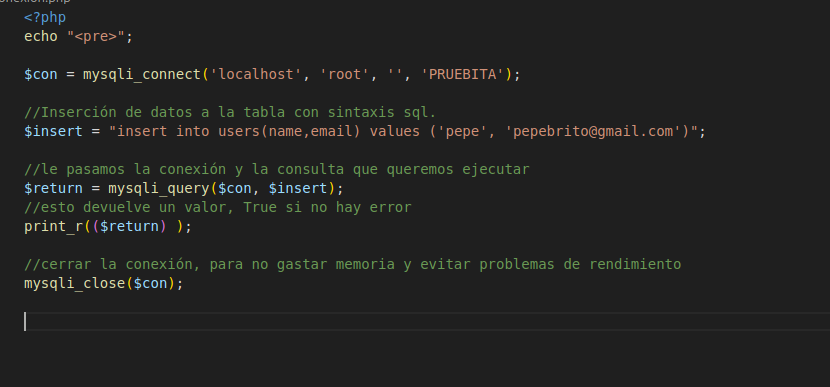
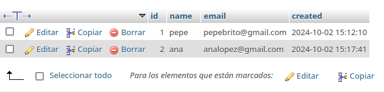

# INSERCIÓN DE DATOS

Para insertar datos a nuestra tabla primero asignamos una variable a una consulta SQL, que incluya "insert into users", (los campos que vamos a rellenar) values (los valores que queremos añadir a esos campos).
Por ejemplo:

`$insert = "insert into users(name, email) values ('pepe', 'pepebrito@gmail.com')";`

La fecha y el id se añadirán automáticamente.

Para ejecutar una consulta, utilizamos la instrucción `mysqli_query`, y le pasamos la conexión y la consulta que queremos ejecutar.
Lo guardamos en una variable.

`$return = mysqli_query($con, $insert);`

Hademos un print, que devolverá true o false para saber si ha ido bien o no la consulta.
`print_r(($return));`

Y por último, cerramos la conexión para evitar problemas de rendimiento y de memoria.
`mysqli_close($con);`

Ahora tenemos que abrir el documento en el navegador. Veremos un 1, que representa true, lo que quiere decir que ha funcionado.

Vamos a myadminphp, a la base de datos, y efectivamente, se han añadido los datos.

De nuevo realizamos otra inseción modificando los datos, y de nuevo, abrimos el documento en localhost. Se añade la nueva información.

