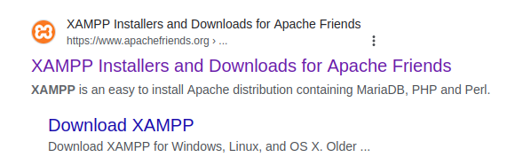
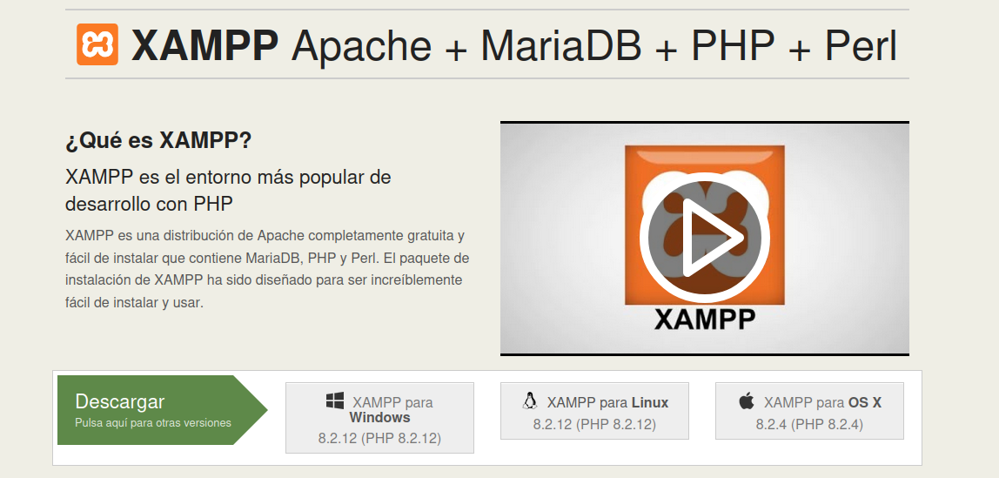
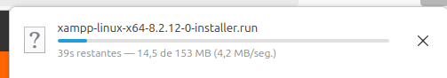
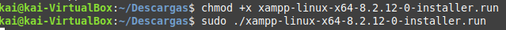
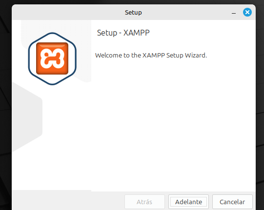
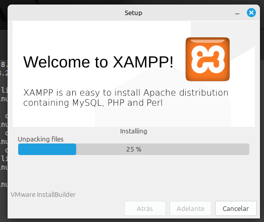
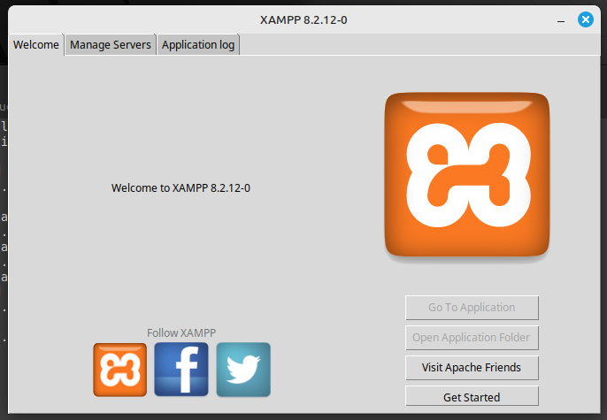
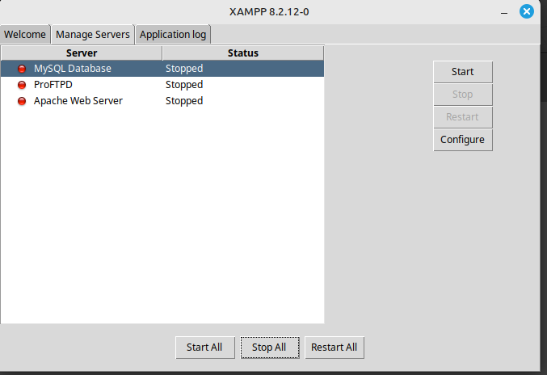
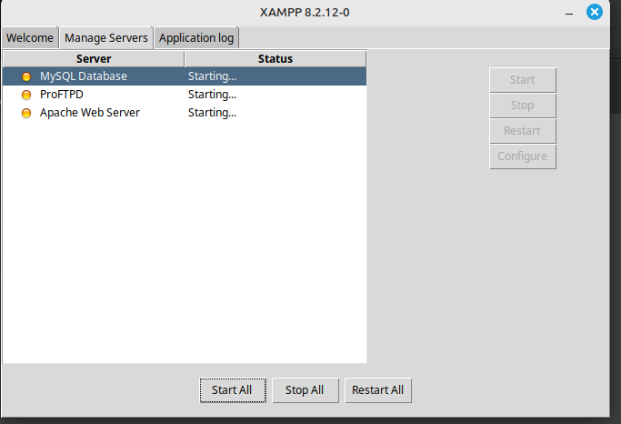
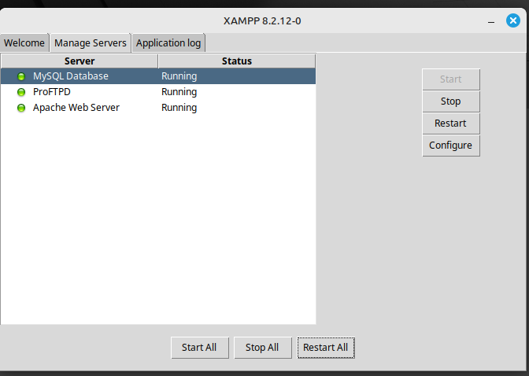

# Instalación de XAMPP

1. Buscamos en el navegador 'XAMPP'.
Le damos click al primer enlace.

2. Ahora hacemos click en la versión de XAMPP para descargar del sistema operativo que tengamos. En este caso, Linux.

3. Se nos descargará el archivo .run

4. A continuación abrimos nuestra terminal, y hacemos 'cd Descargas' o donde tengamos descargado el archivo.

Ahora tenemos que darle el permiso de ejecución al archivo. Para eso escribimos:

`chmod +x xampp-linux-x64-8.2.4-0-installer.run`

Y ahora ejecutamos el archivo, escribiendo:

`sudo ./xampp-linux-x64-8.2.4-0-installer`

5. Al abrir, damos click a 'Adelante' y a siguiente o 'Next' y se instalará.

6. Ahora nos mostrará el panel de XAMPP. 
En la pestaña de Manage Servers, podemos ver el estado de los servidores y encender o apagar los que necesitemos.

Podemos ver que funcionan correctamente.

