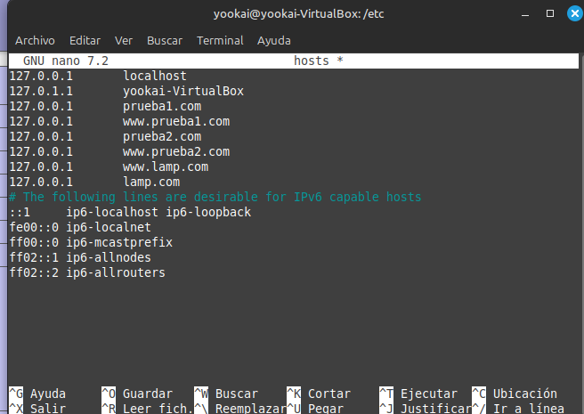
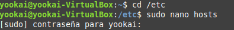
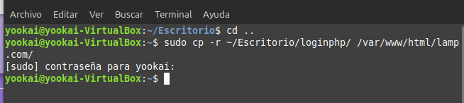
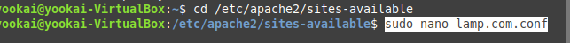
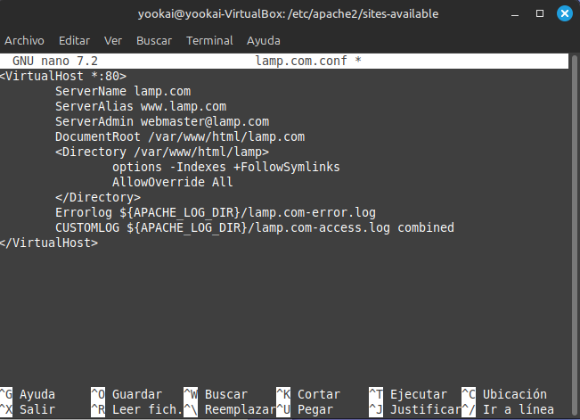
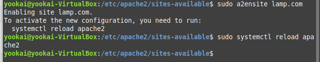
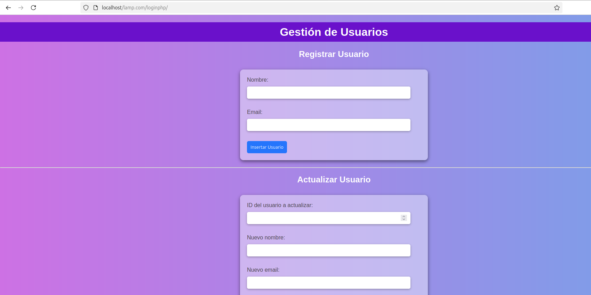
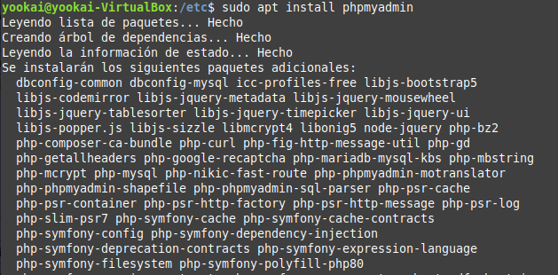
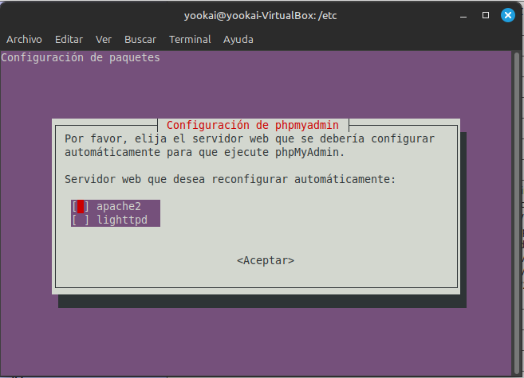
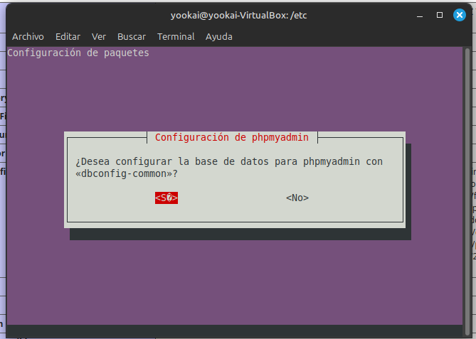

## Instalar en Lamp nuestra página implementada en xampp

configurar un Virtual Host en el archivo de hosts:

```sh
cd /etc
```
```sh
sudo nano hosts
```


```sh
127.0.0.1   lamp.com
127.0.0.1   www.lamp.com
```



Copiar los ficheros a una nueva carpeta

```sh
sudo mkdir /var/www/html/lamp.com
```


```sh
sudo cp -r ~/Escritorio/loginphp/ /var/www/html/lamp.com/
```




Editar configuracion de Apache

Ahora, edita la configuración de Apache para el nuevo Virtual Host:

```sh
cd /etc/apache2/sites-available
```
```sh
sudo nano lamp.com.conf
```



Añadir la condiguración:

```sh
<VirtualHost *:80>
        ServerName lamp.com
        ServerAlias www.lamp.com
        ServerAdmin webmaster@lamp.com
        DocumentRoot /var/www/html/lamp.com
        <Directory /var/www/html/lamp>
                options -Indexes +FollowSymlinks
                AllowOverride All
        </Directory>
        Errorlog ${APACHE_LOG_DIR}/lamp.com-error.log
        CUSTOMLOG ${APACHE_LOG_DIR}/lamp.com-access.log combined
</VirtualHost>
```


Habilitar el sitio web:

```sh
sudo a2ensite lamp.com
```

```sh
sudo systemctl reload apache2
```




Ahora al entrar en el navegador y escribir `localhost/lamp.com/loginphp` aparece el login que subimos.




## Instalar phpMyAdmin

Instala phpMyAdmin utilizando el siguiente comando:

```sh
sudo apt install phpmyadmin

```

Aparecerá un cuadro con opciones. 



Pulsamos Apache2




Crea un archivo de configuración para phpMyAdmin:

```sh
cd /etc/apache2/conf-available
sudo nano phpmyadmin.conf
```

Agrega la siguiente configuración:

```sh
Alias /phpmyadmin /usr/share/phpmyadmin

<Directory /usr/share/phpmyadmin>
    Options SymLinksIfOwnerMatch
    DirectoryIndex index.php
</Directory>

<Directory /usr/share/phpmyadmin/templates>
    Require all denied
</Directory>
<Directory /usr/share/phpmyadmin/libraries>
    Require all denied
</Directory>
<Directory /usr/share/phpmyadmin/setup/lib>
    Require all denied
</Directory>
```


Habilita la configuración de phpMyAdmin:

```sh
sudo a2enconf phpmyadmin.conf
sudo systemctl reload apache2
```


## Crear la base de datos en MariaDB

Accede a MariaDB y crea una nueva base de datos:

```sql
sudo mariadb -u root
CREATE DATABASE lamp;
```


Ahora vamos a nuestra página en infinityfree y accedemos a la base de datos donde dice MYSQL DATABASES


Allí hacemos click en phpMyAdmin


Se nos mostrará el panel de control de phpMyAdmin, donde debemos ingresar a la opción Export.


En esta sección, simplemente debemos hacer clic en Go para exportar nuestra base de datos.


Se nos descargará un archivo con la base de datos

Ahora accedemos a e ingresamos la cuenta y la contraseña, que son las que creamos en la anterior tarea de Mariadb (antes usamos para crear el usuario el comando  `CREATE USER 'developer'@'localhost' IDENTIFIED BY '5t6y7u8i'`)


Ahora Seleccionamos la base de datos que hemos creado previamente, en este caso lamp.


Y le damos click a `Importar`.

En esta sección, seleccionamos el archivo de la base de datos que exportamos anteriormente desde InfinityFree haciendo clic en Examinar.

Y por último seleccionamos `Importar` en la parte inferior de la página.

Nos aparecerá un mensaje de éxito si todo ha ido bien.


