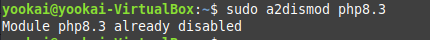

## Instalación en Ubuntu Server

### Sistema Operativo

Para garantizar que el sistema esté al día con las últimas actualizaciones de seguridad y mejoras, se ejecutan los siguientes comandos:

```sh
sudo apt update
sudo apt upgrade
```

### Servidor Web: Instalación de Apache

En la tarea anterior ya habíamos instalado y configurado Apache.
Para comprobar que está instalado correctamente, se puede ejecutar el siguiente comando:

`sudo systemctl status apache2`


### Sistema de Gestión de Bases de Datos: Instalación de MaríaDB

1. **MariaDB se instala con el siguiente comando:**

```sh
sudo apt install mariadb-server mariadb-client
```

2. **Después de la instalación, el servidor MariaDB se inicia automáticamente. Para comprobar el estado del servidor, se utiliza el siguiente comando:**

```sh
sudo systemctl status mariadb
```


3. **Para asegurarnos de que MariaDB se inicie automáticamente al arrancar el sistema, ejecutamos:**

```sh
sudo systemctl enable mariadb
```


4. **Para verificar la versión instalada de MariaDB, se utiliza el siguiente comando:**

```sh
madiadb --version
```


5. **Ejecutamos el script de seguridad de MariaDB con el siguiente comando:**

```sh
sudo mysql_secure_installation
```

Durante este proceso, se nos pedirá que configuremos la contraseña de root. Inicialmente, pulsamos Intro para dejarla vacía y luego ingresamos la nueva contraseña. A continuación, respondemos a las preguntas para eliminar el usuario anónimo, deshabilitar el inicio de sesión remoto de root y eliminar la base de datos de prueba.


---

**Autenticación con unix_socket**

Por defecto, MariaDB utiliza unix_socket para autenticar el inicio de sesión del usuario root. Esto significa que el usuario root puede conectarse a la base de datos sin necesidad de una contraseña, siempre que esté utilizando el mismo usuario del sistema operativo. Esto proporciona una capa adicional de seguridad, ya que solo los usuarios con acceso al sistema pueden acceder a la base de datos como root.

---

6. **Para probar el acceso a la base de datos con la nueva contraseña, utilizamos el siguiente comando:**

```sh
mariadb -u root -p
```


7. **Para crear un nuevo usuario llamado `developer` con la contraseña `5t6y7u8i`, se utilizan los siguientes comandos:**

```sql
CREATE USER 'developer'@'localhost' IDENTIFIED BY '5t6y7u8i';
GRANT ALL PRIVILEGES ON *.* TO 'developer'@'localhost';
FLUSH PRIVILEGES;
```


8. **Para iniciar sesión en la base de datos con el nuevo usuario creado, utilizamos el siguiente comando:**

```sh
mariadb -u developer -p
```


### Lenguajes de Programación: Instalación de PHP

1. **Para instalar PHP y algunos módulos comunes, se utiliza el siguiente comando:**

```sh
sudo apt install php8.3 libapache2-mod-php8.3 php8.3-mysql php-common php8.3-cli php8.3-common php-json php8.3-opcache php8.3-readline
```


2. **Activamos el módulo PHP y reiniciamos el servidor Apache con los siguientes comandos:**

```sh
sudo a2enmod php
sudo systemctl restart apache2
```


3. **Para verificar la versión de PHP instalada, utilizamos el siguiente comando:**

```sh
php --version
```


4. **Para probar los scripts PHP con el servidor Apache, creamos un archivo llamado info.php en el directorio raíz del servidor web:**

```sh
sudo vim /var/www/html/info.php
```


Dentro del archivo, insertamos el siguiente código PHP:

```php
<?php phpinfo(); ?>
```

5. **Una vez guardado el archivo, podemos acceder a él a través del navegador escribiendo la dirección: `http://dirección-ip/info.php`**


### Ejecutando código PHP en Apache

Existen dos formas de ejecutar código PHP con el servidor web Apache: utilizando el módulo PHP de Apache o PHP-FPM. En los pasos anteriores, se utilizó el módulo PHP para manejar el código PHP. Sin embargo, en algunos casos, es preferible utilizar PHP-FPM.

1. **Para cambiar a PHP-FPM, primero deshabilitamos el módulo PHP de Apache:**

```sh
sudo a2dismod php8.3
```


2. **Instalamos PHP-FPM con el siguiente comando:**

```sh
sudo apt install php8.3-fpm
```


3. **A continuación, habilitamos los módulos proxy_fcgi y setenvif:**

```sh
sudo a2enmod proxy_fcgi setenvif
```


4. **Habilitamos el archivo de configuración de PHP-FPM:**

```sh
sudo a2enconf php8.3-fpm
```


5. **Finalmente, reiniciamos el servidor Apache para aplicar los cambios:**

```sh
sudo systemctl restart apache2
```


Ahora, si actualizamos la página `info.php` en el navegador, deberíamos ver que la API del servidor ha cambiado de "Apache 2.0 Handler" a "FPM/FastCGI". Esto indica que el servidor web Apache ahora está pasando las solicitudes de PHP a PHP-FPM.

