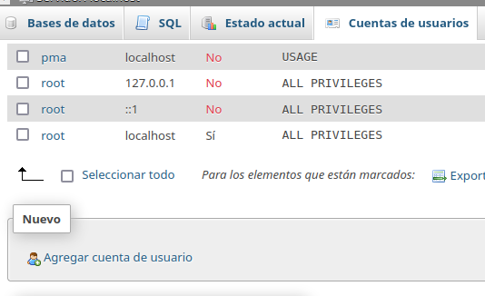
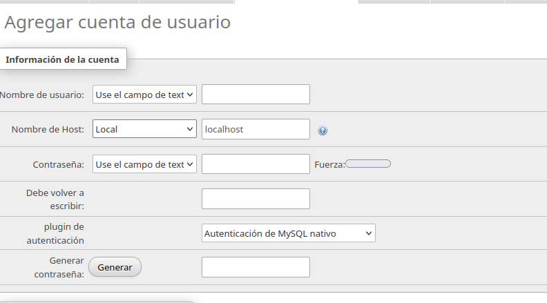

# Seguridad

1. Abrir XAMPP

2. Encender:

Le damos a Start All.

3. Abrir localhost en el navegador.

4. Ir a sq, privilegios, cambiar contraseña
NO deja, porque se debe editar primero el fichero de configuración

5. Para eso, abrir la carpeta de XAMPP y localizar el config.

6. Buscar la línea de contraseña, y escribir entre las comillas una contraseña. Luego guardamos los cambios del archivo.
Ya tenemos una contraseña para esa cuenta.

7. Creamos ahora otra cuenta. Para ello vamos a cuentas de usuario, y luego a agregar cuenta de usuario.

Ponemos un nombre de usuario y una contraseña. Al Nombre de Host seleccionamos la opción  "Local".

En la base de datos para la cuenta de usuario, damos click solo a la primera opción.

EN los privilegios globales, seleccionamos Datos y Estructura, y no Administración ya que no queremos darle a este permisos de administrador.

8. Ahora, queremos que nos aparezca la ventana que nos pregunte por el usuario y la contraseña al entrar a localhost.

Para ello, de nuevo abrimos el mismo fichero de configuración.
Y donde pone config en la sección de Authentification Type, cambiamos "config" por "http".

Ahora, ya podemos entrar como root o como el otro usuario.

