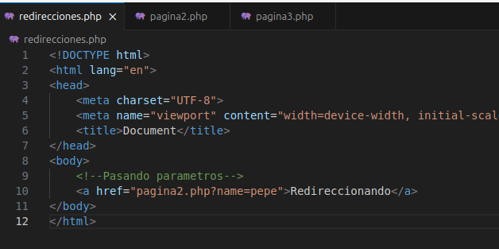

# Redireccionamiento de páginas en PHP

1. En primer lugar, es necesario tener abierto XAMPP y los servidores encendidos. 

2. Es iimportante también tener la carpita con los archivos en los que vayamos a trabajar en la carpeta opt/lampp/htdocs para poder abrirlos en el navegador con localhost.

3. Creamos un documento, que voy a llamar redirecciones.php. Escribimos la estructura de HTML (pulsando ! + ENTER), y escribimos un enlace hacia una "pagiina2.php".

4. Creamos la página "pagina2.php". En ella, hacemos un echo indicando que se trata de la página 2.

5. Abrimos recireciones.php en el navegador mediante localhost.

6. Le damos click al enlace, y vemos que nos dirige hacia la página 2.

7. Ahora vamos a redirigir a la página 3 utilizando la etiqueta header, escribiendo lo siguiente:

8. Creamos la página 3 a la que queremos que nos rediriga la página 2, de nuevo escribiendo un echo.

9. De nuevo abrimos la página de redirecciónes.

10. Al darle click, vemos que nos encontramos en la pagina3.php, porque nos ha redirigido la página 2 directamente.

11. También podemos pasarle parámetros, como por ejemplo, el nombre.

12. Para mostrar esta información en pantalla, escribimos en la página 2 `print_r($_GET);`. Y comentamos la línea del header.

13. Ahora al dar click en redireccionar, nos muestra los datos.

14. También podemos mandar los datos directamente desde el servidor con php a la página 3.

15. Para imprimir la información, de nuevo hacemo sun print de GET.

16. Al dar click al enlace esta vez, vamos como ha funcionado como esperábamos.

