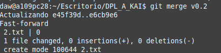
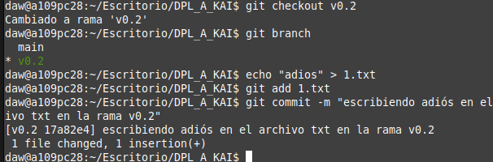
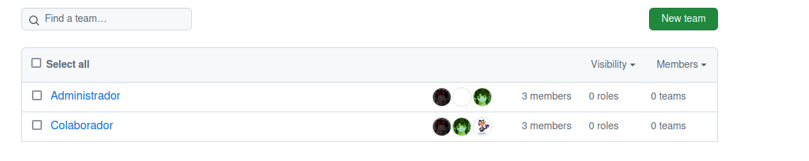

# Tarea 1.2- Trabajando con Git y MarkDown II

Para la entrega de esta y las sucesivas tareas/prácticas que hagamos durante el curso haremos uso de GitHub, deberán enviarme a través de Campus el enlace a la práctica así como el commit que indique la fecha de entrega. Este commit debe reflejar una fecha que se encuentre dentro del plazo establecido para la realización de la práctica marcado a través de la plataforma Campus, en caso contrario se dará por suspendida la práctica.

Este ejercicio es continuación del anterior por lo que tendremos el mismo repositorio.

Se deben incluir todos los comandos que se usen durante el ejercicio, las explicaciones y capturas de pantalla en el fichero README.me del repositorio.

### CREAR UNA RAMA  v0.2(1 PUNTO)

- Crear una rama v0.2.

``git checkout -b v0.2``


- Posiciona tu carpeta de trabaja en esta rama.


### AÑADIR  EL FICHERO 2.txt  (1 PUNTO)

Añadir un fichero 2.txt en la rama v0.2

``touch 2.txt``


```git add 2.txt```

``git commit -m "creando el archivo 2 en la rama v0.2"``


### CREAR UNA RAMA REMOTA v0.2 (1 PUNTO)

Subir los cambios al repositorio remoto.
``git push origin v0.2``


### MERGE DIRECTO (1 PUNTO)

Posicionarse en la rama master.
Hacer un merge de la rama v0.2 en la rama main.

``git checkout main``


``git merge v0.2``



### MERGE CON CONFLICTO (1 PUNTO)

En la rama master poner Hola  en el fichero 1.txt y hacer commit.
Posicionarse en la rama v0.2 y poner Adios en el fichero 1.txt y hacer commit.
Posicionarse de nuevo en la rama master y hacer un merge con la rama v0.2

``echo "Hola" > 1.txt``
``git add 1.txt``
``git commit -m "Añadido 'Hola' al fichero 1.txt en la rama master"``


Posicionarse en la rama v0.2 y poner Adios en el fichero 1.txt y hacer commit.

1º ``git checkout v0.2`` Para posicionarme en la rama v0.2

2º ``echo "Adios" > 1.txt``

3º ``git add 1.txt``

4º ``git commit -m "Añadido 'Adios' al fichero 1.txt en la rama v0.2"``



Posicionarse de nuevo en la rama master y hacer un merge con la rama v0.2

``git checkout master``


``git merge v0.2``

### ARREGLAR  CONFLICTO (1 PUNTO)

Arreglar el conflicto anterior y hacer un commit. Explicar como lo has arreglado incluyendo capturas de pantalla.


Para arreglarlo tuve que hacer un:

git add 1.txt
git commit -m "Resuelto conflicto en 1.txt"

### LISTADO DE RAMAS (1 PUNTO)

Listar las ramas con merge y las ramas sin merge.

``git branch --merged``

``git branch --no-merged``


### BORRAR RAMA (1 PUNTO)

Crear un tag v0.2

```git tag v0.2```


Borrar la rama v0.2

```git branch -d v0.2```

```git push origin --delete v0.2```


### LISTADO DE CAMBIOS (1 PUNTO)

Listar los distintos commits con sus ramas y sus tags.

```git log --oneline --decorate --all --graph```


### CREAR UNA ORGANIZACIÓN (1 PUNTO)

Crea una organización llamada orgdpl-tunombredeusuariodegithub ( ejemplo orgdpl-amarzar )


Link a la Organización:
https://github.com/orgdpl-YoooKai

### CREAR EQUIPOS 

Crear dos equipos en la organización orgdpl-tunombredeusuariodegithub, uno llamado administradores con más permisos y otro colaboradores con menos permisos.

- Meter a github.com/amarzar y a 2 de vuestros compañeros de clase en el equipo de administradores.
- Meter a github.com/amarzar y a 2 de vuestros compañeros de clase en el equipo de colaboradores.




### CREAR UN index.html

- Crear un index.html que se pueda ver como página web en la organización.


### CREAR PULL REQUESTS

- Hacer 2 forks de 2 repositorios orgdpl-tunombredeusuariodegithub.github.io de 2 organizaciones de las que sean ni administradores ni colaboradores.
- Crear una rama en cada fork.
- En cada rama modificar el fichero index.html añadiendo vuestro nombre.
- Con cada rama hacer un pull request.


### GESTIONAR PULL REQUESTS

- Aceptar los pull request que lleguen a los repositorios de tu organización.


