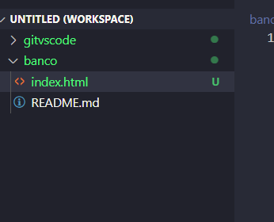

#  Trabajando con con el Visual Studio y nuestro repositorio en Github.

1. En priimer lugar, hay que tener una cuenta en GitHub. Es un proceso muy sencillo. Pero en mi caso, la tengo ya desde hace tiempo.

2. Vamos a crear un repositorom que se llamará "banco" para esta práctica. Para eso vamos a nuestros repostoros y hacemos click en New. Ahora le ponemos el nombre a nuestro nuevo repositorio, y hacemos click en "Create Rrepository".

3. Ahora abrimos Visual Studio Code. Hacemos click en Ctrl + Shft + P, o hacemos click donde dice View en el navegador superior, y luego a Command Palette.

4. Se nos abrirá un inpout de texto, donde debemos escribiri Git: Clone, y ejecutamos esa opción. Ahora, de nuevo nos pide que peguemos el código al repositorio que queremos clonar. Para ello, en nuestro repositoro de GitHub, pulsamos el botón de "<> Code" y copiamos la dirección.
Luego, pegamos en el input de Visual Studo Code esa direccón.

5. Nos pide una ubicación para guardar el repositorio.
Yo he creado una carpeta llamada pruebas para ello.

6. Nos aparece esta ventana, y le damos a "Add to workspace" para abrir el contenido del repositorio.

7. Ahora, creamos una rchivo "index.html" en la carpeta de banco.

8. Tenemos que acceder al panel de control, que está a la izquierda del todo, el tercer icono. 
Debajo de Changes, están todos los archivos modificados. 
Tenemos que darle al símbolo de "+" para agregar los cambios a GitHub.

9. Pulsamos los tres puntos al lado del nombre del repositorio, y hacemos click en "Push" para subir los cambios a nuestra rama de trabajo. Nos saldrá una confirmacón de carga de código, y le damos a aceptar.

10. Hacemos un commit de los cambios haciendo click en el tick al lado del nombre del repositorio.
Escrbimos un mensaje para el commit en el input que nos aparecerá, y pulsamos Enter.

11. En el icono del bucle tambiién podemos hacer clcik para subr los cambios a GitHub mediante la sincronización:

12. Confirmamos la sincronización de los cambios con GitHub.

13. Comprobamos que se ha subido el nuevo archvo a GitHub.

