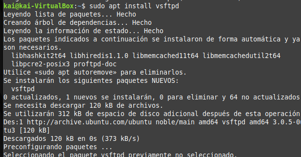

# Instalación y Configuración de VSFTPD

1. Limpieza de Instalaciones Anteriores

Si has intentado instalar o configurar vsftpd previamente, elimina cualquier rastro con:

`sudo apt remove --purge vsftpd`

2. Instalación del Paquete vsftpd

Instala el servidor FTP ejecutando:

`sudo apt install vsftpd`

3. Verifica el Estado del Servicio

Para comprobar que el servicio se ha instalado y está activo:

`sudo service vsftpd status`

4. Configurar la IP del Servidor

Determina la IP de tu servidor con:

`ip a`

Anota la dirección inet de la interfaz correspondiente.

5- Ahora, tenemos que entrar al archivo de configuración y escribir lo siguiente, utilizando la ip que sacamos anteriormente para que el servidor sepa a que ip tiene que atender. En este caso como el cliente tiene la misma que el servidor al ser una máquina virtual, escribo el mismo.
Para acceder al archivo escribimos:

`sudo nano /etc/netplan/00-installer-config.yaml`

6- Aplicamos los cambios con `sudo netplan apply`
nos da unos avisos pero realiza los cambios.

## Configuración Básica

Edita el archivo de configuración de vsftpd

`sudo nano /etc/vsftpd.conf`

Es importante poner la red en red interna en el servidor y en el cliente antes de realizar estos pasos.

Modifica o añade las siguientes líneas
Esto permite conexiones anónimas y especifica un directorio raíz para usuarios anónimos.

`anonymoys_enable=YES`

También es importante escribir:

`anon_root=/srv/ftp/anonimo`

Y ahora con la IP y el usuario anonymous deberíamos poder conectarnos en filezilla.

6. Permitir Usuarios Locales y Escritura

Para habilitar a los usuarios locales y permitir que puedan escribir en sus directorios:

Edita el archivo de configuración:

`sudo nano /etc/vsftpd.conf`

Añade o cambia las siguientes líneas:

`local_enable=YES`

`write_enable=YES`

`local_umask=022`

Reinicia el servidor:

`sudo service vsftpd restart`

Nos conectamos con nuestro usuario administrador en filezilla:

Vemos que podemos entrar y mover y los archivos. Por ejemplo, movemos el archivo administrador.txt

## Otras configuraciones:

### Cambiar el mensaje al conectarse al servidor.
Es muy sencillo, solo tenemos que encontrar esta línea en el archivo de configuración, y escribir lo que queramos:
`ftpd_banner=Welcome to my FTP server`

Reiniciamos el servidor.

Y nos conectamos para ver el mensaje:

`ftp 10.0.2.15`

## Activar el fichero de los logs
Por si ocurre algún error, esto quedará registrado.
Habilitamos esta línea.

`xferlog_file=/var/log/vsftpd.log`

Y para probarlo, vamos a ver las últimas 10 líneas del archivo de logs.

`sudo tail -n 10 /var/log/vsftpd.log`

## Cerrar la conexión cuando haya ocurrido determinado tiempo
Para que no se quede conectado indefinidamente, podemos configurar el tiempo de inactividad.
`idle_session_timeout=10`

Ponemos 10, que son 10 segundos para probar, y luego ya ponemos el tiempo que queramos.

Reiniciamos el servidor:

Y pasados esos segundos, no ha cerrado la conexión como indica el mensaje de estado en filezilla.

Generar certificado autofirmado que cifre las conexiones para que sea más seguero el servidor ftp.
Para ello utilizamos el siguiente comando:

`openssl req -x509 -nodes -newkey rsa:2048 -keyout /etc/ssl/private/sftpd.pem -out /etc/ssl/certs/vsftpd.pem -days 365
`
Nos pedirá unos datos nuestros:

También debemos modificar el archivo de configuración y cambiar esstas líneas:

`rsa_cert_file=/etc/ssl/certs/ssl-cert-snakeoil.pem`
`rsa_private_key_file=/etc/ssl/private/ssl-cert-snakeoil.key`
`ssl_enable=NO`

Por estas otras:

`rsa_cert_file=/etc/ssl/certs/vsftpd.pem`
`rsa_private_key_file=/etc/ssl/private/vsftpd.pem`
`ssl_enable=YES`

Reiniciamos el servidor y, con el siguiente comando podemos comprobar que se ha generado el certificado autofirmado:

`openssl rsa -in /etc/ssl/private/vsftpd.pem -check`

Ahora cuando nos conectemos al servidor, nos aparecerá el mensaje y una confirmación.
