## Gestión de Usuarios

Crea un nuevo usuario con:

 `sudo adduser <nombre_usuario>`

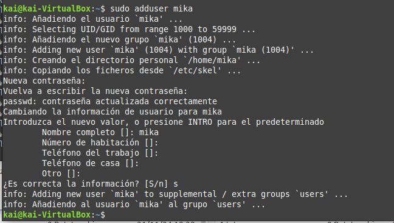

Verifica que se ha creado correctamente con el comando:

`cat /etc/passwd`

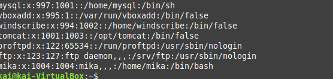

Edita el archivo de configuración otra vez:

`sudo nano /etc/vsftpd.conf`

Añade o modifica las siguientes líneas

`chroot_local_user=YES`

`chroot_list_enable=YES`

`chroot_list_file=/etc/vsftpd.chroot_list`

`allow_writeable_chroot=YES`

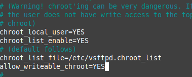

Crea el archivo /etc/vsftpd.chroot_list y añade los nombres de los usuarios que podrán moverse fuera de su directorio raíz:

`sudo nano /etc/vsftpd.chroot_list`

Añadimos el nombre de los usuarios que queramos que tengan permiso para moverse libremente en el servidor, como el administrador.

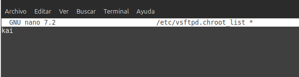

Hacemos un reinicio para guardar los cambios y comprobamos el estatus del servidor:

`sudo service vsftpd restart`

`sudo service vsftpd status`

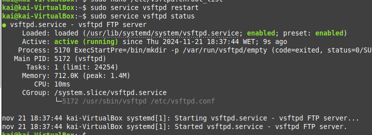

Vemos que este usuario que no ha sido añadido a la lista, no puede moverse por el servidor, solo puede acceder a su carpeta personal.

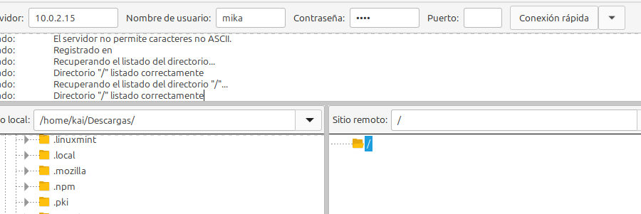

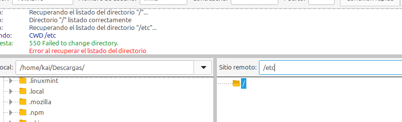

Y, sin embargo, el usuario que sí ha sido añadido a la lista, puede moverse por el servidor.

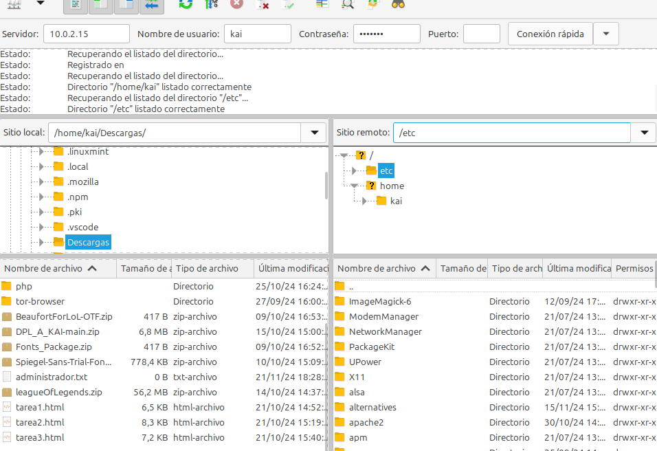

Ahora añadimos este usuario a la lista chroot_list y guardamos los cambios.

Tenemos que resetear de nuevo el servidor:

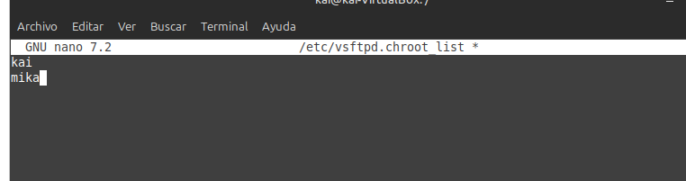

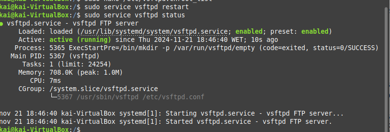

Y al conectarnos con este usuario, vemos que ahora sí puede salir de su directorio.

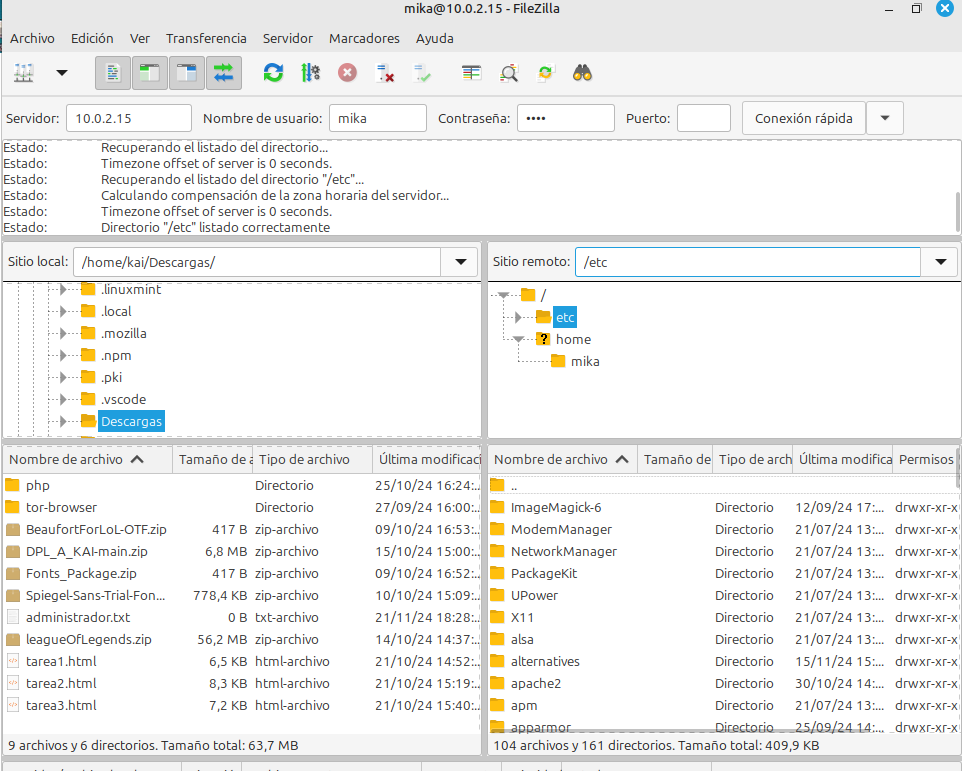

### Denegar acceso a Usuarios

Ahora vamos a denegarle la conexión a otros usuarios, por lo que creamos un par de usuarios nuevos:

`sudo useradd <nombredeusuario>`

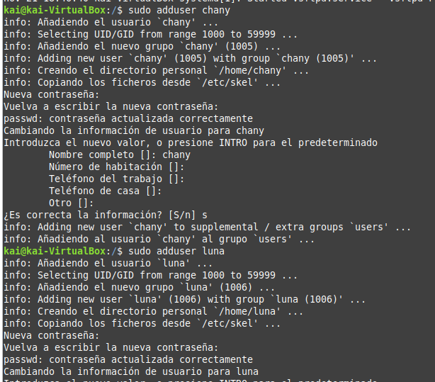

Para eso, modificamos el archivo de configuración otra vez:

`sudo nano /etc/vsftpd.conf`

Y nos aseguramos de que estén estas líneas, o las creamos:

`userlist_enable=YES`

`userlist_deny=YES`

`userlist_file=/etc/vsftpd.user_list`

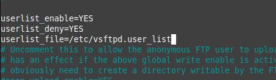

Ahora creamos un archivo llamado `vsftpd.user_list` en el directorio `/etc/ para añadir a los usuarios a los que queramos quitarles el acceso a la conexión, y los añadimos:

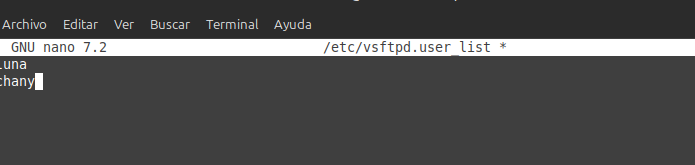

De nuevo, reiniciarmos el servidor:

`sudo service vsftpd restart`

`sudo service vsftpd status`

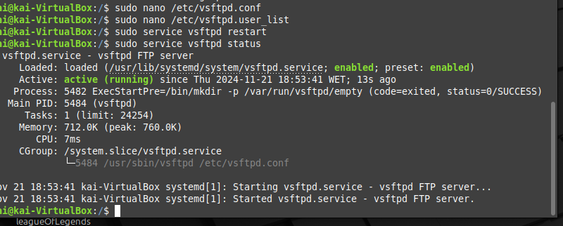

Probamos a intentar conectarnos con el usuario que hemos añadido a esta lista:

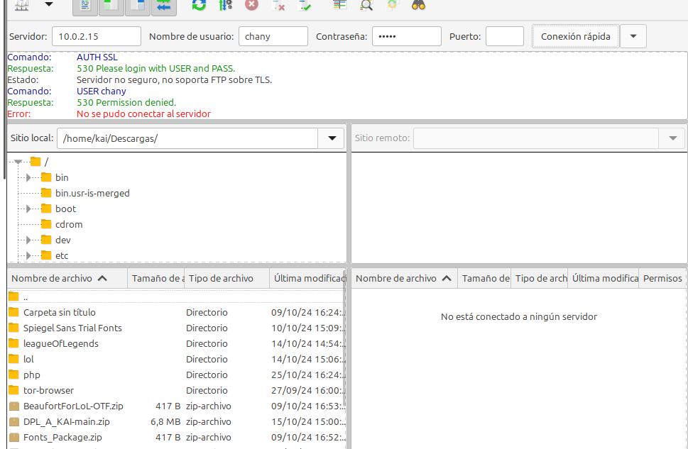

Y el otro:

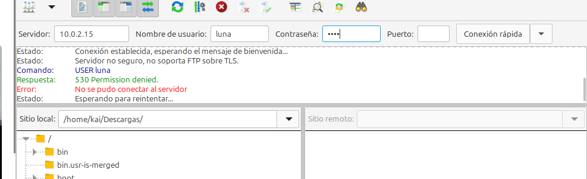

Efectivamente, no podemos conectarnos con estos usuarios.
Sin embargo, eliminamos a uno de esta lista, y ahora sí permite la conexión.

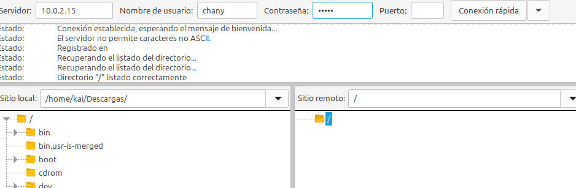